# 团队实战第1天

## 00.自我介绍

1. 王侨文
2. 9年开发经验，2年java+7移动前端开发
3. 汇丰银行+360+乐信（分期乐会员）

> 一天边讲边练7小时


## 01.团队实战介绍

概念：就是模拟企业开发流程

如何操作：每个组模拟为一个独立的团队，开发项目。由组长分配任务给组员，组员新建任务分支，每天汇报任务进度。完成任务代码分支后合并到统一的分支上进行测试修复。修复完成发布上线。

意义：

1. 整个流程和企业相似，让大家可以更快地适应工作，和应付面试
2. 真实git使用场景
3. 团队协作

## 02.课程安排

1. 第1天 环境准备
2. 第2-4天 写代码
3. 第5天 测试+项目总结

## 03.项目介绍-产品

​	[线上完整项目]( http://jovenwang.gitee.io/topline-admin )

产品名称：黑马头条后台管理系统

产品简介：黑马头条移动端就一个新闻资讯App, 需要发布新闻进行管理，所以需要开发一个后台管理系统。

产品目标：后台管理系统数据支撑。

1. 数据库的一个界面。方便操作

   

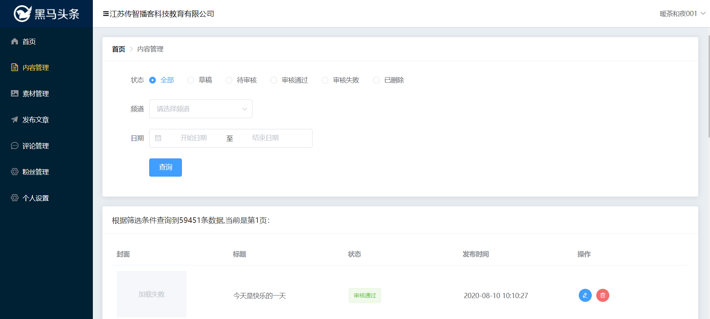


## 04.禅道介绍

 在禅道项目管理软件中，核心的角色有产品经理、项目经理、研发团队和测试团队四种角色。如果您现在的团队是采用敏捷开发的话，那么可以对应到product owner, scrum master和team(dev and tester)。这几种角色之间紧紧围绕产品的需求展开协作，取得成果。禅道核心的管理流程全图如下所示： 

1. 产品经理和项目经理有时候身份是重合的，不仅提需求，而且要统筹资源
2. 研发团队，包括前端和后端
3. 测试团队：测试的

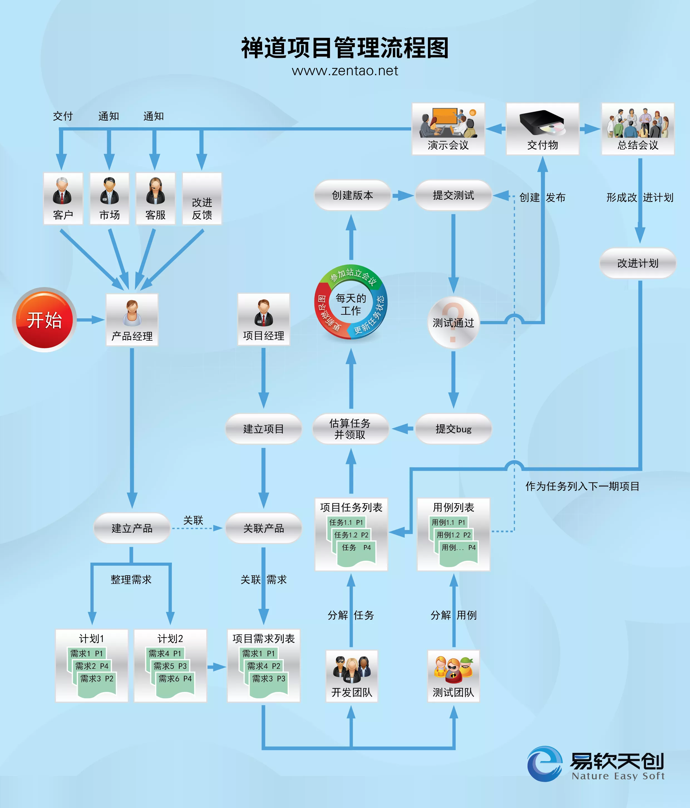

> 敏捷开发项目管理软件有很多：tapd,禅道

## 05.禅道系统登录

网址：http://129.211.82.55/zentao/user-login.html

用户名：你发给葛老师的邮箱

密码：`a123456!`

> 如果真心找不到的话，确认一下邮箱是否对。再不行，私聊我


## 06.禅道-添加项目（组长）

> 此操作由项目经理（组长）完成

项目-添加项目或者直接跳转http://129.211.82.55/zentao/project-create.html 

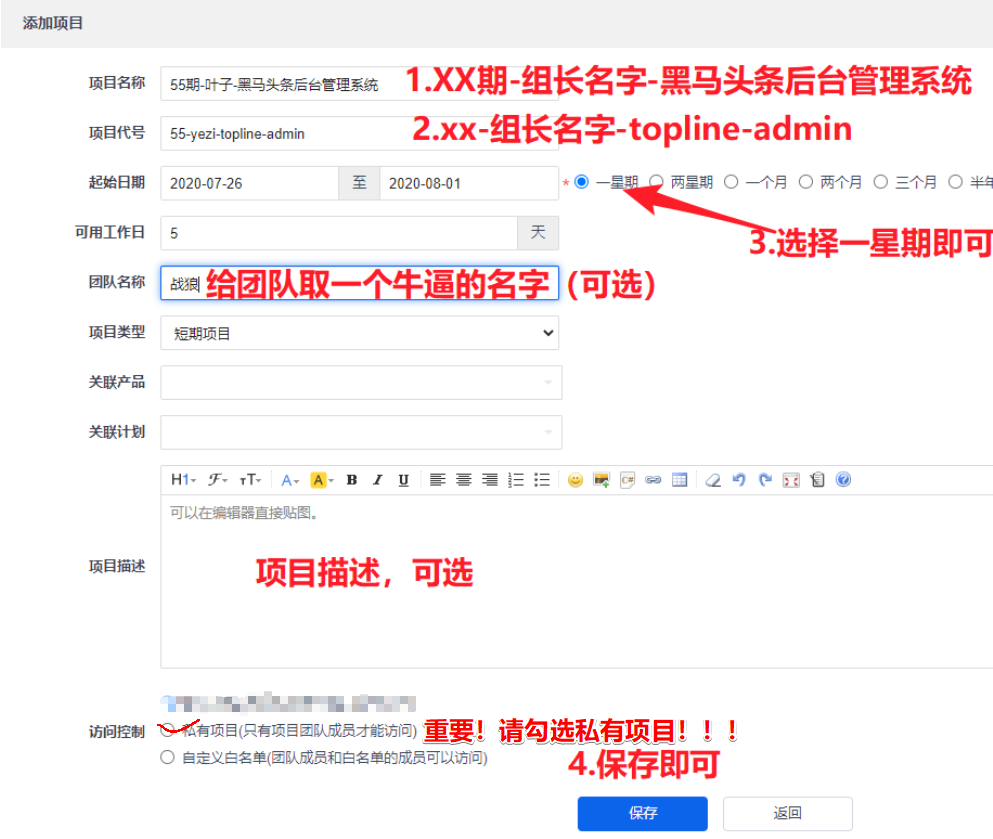

## 07.禅道-添加团队成员（组长）

> 此操作由项目经理（组长）完成

1. 访问   http://129.211.82.55/zentao/project-all-all.html   进入所有项目列表
   1. 找到你刚才创建的项目且进入


3. 进入刚才创建项目的团队成员列表


4. 进入刚才创建项目的团队管理页面


5. 添加成员


6. 当前创建项目成功，按提示点击`设置团队`, 可快速进入团队管理

   


## 08.禅道-分配任务（组长）

> 此操作由项目经理（组长）完成

1、进入刚才创建项目的概览页面。

- 先访问   http://129.211.82.55/zentao/project-all-all.html   进入所有项目列表
- 找到你刚才创建的项目且进入。


2、进入刚才创建项目的任务管理列表。


3、添加任务

- 点击上图的`建任务`进入添加页面
- 请按照下图的标注进行添加即可

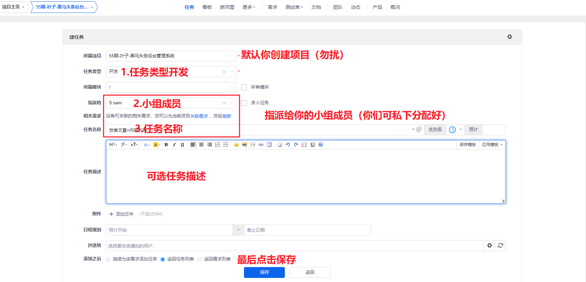


## 09.禅道-开始任务（组员）

> 此操作由开发人员（组员）完成

操作地址： http://129.211.82.55/zentao/my-task.html 


- 备注：大家也可以按照一天 **8** 工时计算3天的预计剩余为 24 工时。


## 10.禅道-每日汇报（组员）

> 此操作由开发人员（组员）完成

在每天下班前，在自己的任务页面，进行每日工作汇报。

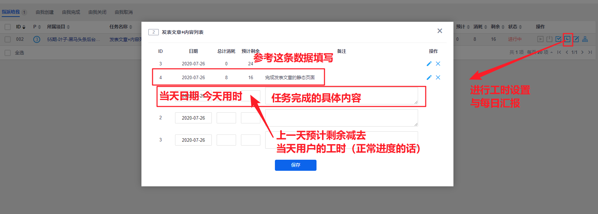


## 11.禅道-查看进度（组员|组长）


- 备注：这个是查看功能，不需要操作，用了查看任务进度。


## 12.git复习


#### 问题：

1. 什么是分支？

   1. 可以理解成独立的"仓库", 不同分支代码不一样

2. 克隆项目到本地，需要在本地执行先git init吗？不需要

   1. git init会在目录下新建一个`.git`文件
   2. 远端已经有.git文件
   3. 所以git clone无须先执行git init

   

#### **git克隆支持两种协议，https和ssh**

1. https者推送时需要输入用户名和密码
   1. 有点的命令行工具会保存你的用户名和密码,不安全的
   2. 实际工作中不建议使用https
2. ssh在推送时需要不输入用户名和密码，需要配置一个ssh 公钥
   1. ssh公钥就是让远端确认你的电脑是可信的


## 13.team_combat项目克隆

团队实战课程地址：  https://gitee.com/jovenwang/team_combat.git  分支：tc56

[如何生成公钥和添加公钥](https://gitee.com/help/articles/4181)

1. 生成公钥

   1. 任意目录下执行

   ```bash
    ssh-keygen -t rsa -C "填写你真实的邮箱"
   ```

   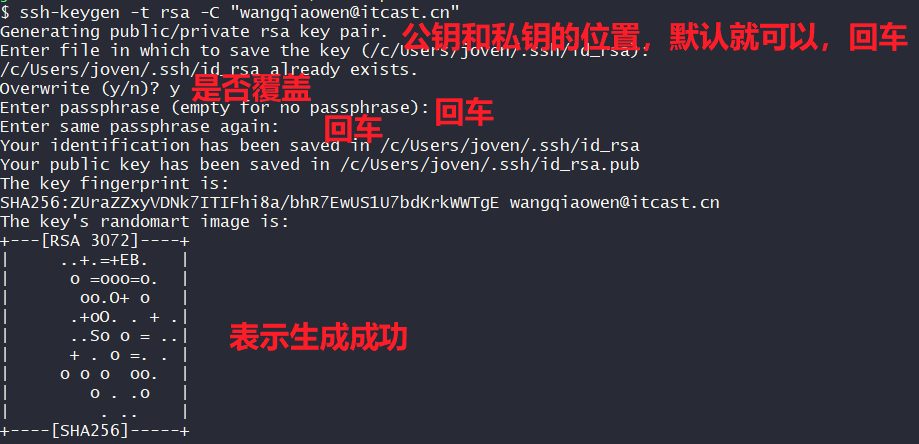

   

2. 复制公钥

   ```bash
   cat ~/.ssh/id_rsa.pub
   ```

   

3. 添加公钥

   1. 码云头像->设置->SSH公钥
   2. 在输入框粘贴第2步复制的公钥,添加


4. 选择一个存放team_combat目录, 打开git bash,再执行克隆

```bash
git clone git@gitee.com:jovenwang/team_combat.git
```

5. 切换分支

```bash
cd team_combat
git checkout tc56
```

1. **记住一定要cd到你需要切换分支的项目目录下，所以cd一定要！！！**

2. 首次使用需要确认并添加主机到本机SSH可信列表

   

#### 注意点：

1. windows电脑需要打开以下

   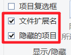

2. git bash的一些常用命令

   1. cat是查看当前文件的内容
   2. cd 去到某目录
   3. ls 列表出当前目录下所有的文件或者目录
   4. ~代表home目录，表示当前登录系统用户目录
   5. 命令行时里面复制粘贴，右键

3. 这个公私钥码云和github是通用的吗？？？

   1. 是的。
   2. 如果要克隆github项目的话，在github添加一次公钥
   3. 如果换电脑的话，需要重新生成公钥和和私钥，需要重新添加

4. git branch命令

   1. 列出当前项目的本地分支
   2. git branch -a 查看本地和远程的分支

5. 以下网络不行，重新执行

   

6. 刚刚克隆的预习资料，项目代码一会讲
7. `ssh -T git@gitee.com`可以不用执行这个命令，因为git clone时也会提示
8. 线上项目的图片问题，尽量下午之前能解决掉


## 14.git协同开发-克隆项目(组长)

- 远程仓库地址：  https://gitee.com/jovenwang/topline-admin-template  

```bash
# 在合适目录执行
git clone git@gitee.com:jovenwang/topline-admin-template.git
```


## 15.git协同开发-创建远端仓库(组长)

1. 在码云上创建仓库

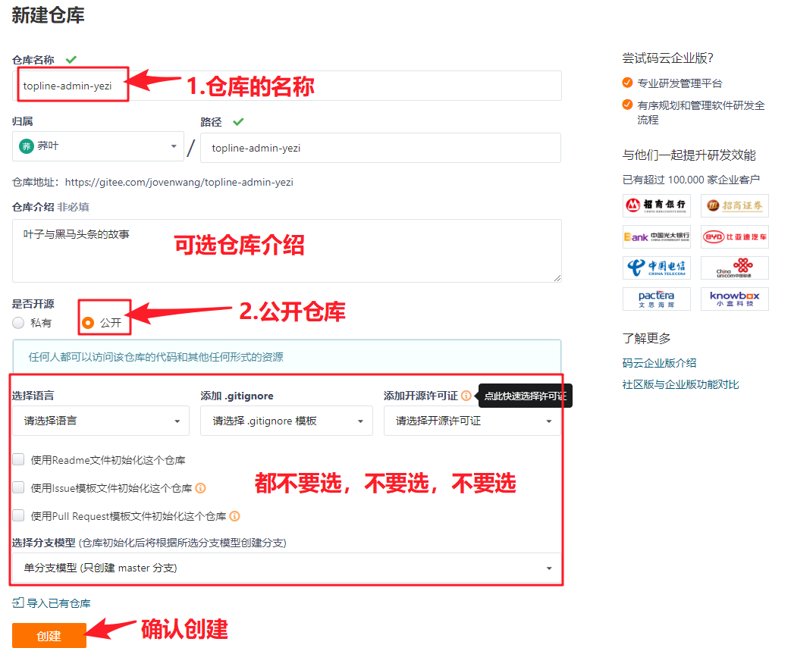


## 16.git协同开发-推送本地仓库到远端(组长)

- 需要根据已有项目初始化属于自己小组的项目，创建不同代码分支。

- 具体步骤：

  - 删除项目中的 `.git` 文件夹

  - 初始化仓库 `git init`

  - 添加暂存区 `git add .`

  - 提交本地仓库 `git commit -m 项目初始化`

  - 添加远端仓库地址，并推送

    ```bash
    #去到需要推送到远端的项目地址
    git init
    git add .
    git commit -m "first commit" #提交
    #添加远端仓库地址
    git remote add origin git@gitee.com:jovenwang/topline-admin-quick.git
    #在远端创建master分支，并推送本地master到远端master
    git push -u origin master
    ```


## 17.git协同开发-远端创建`develop`分支(组长)

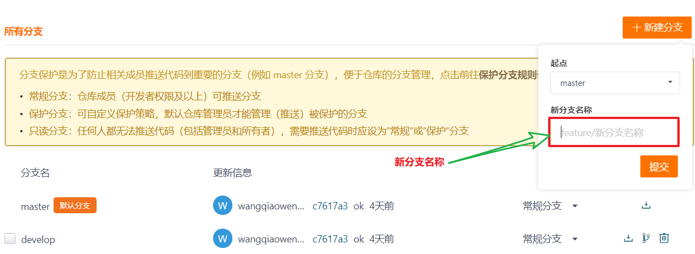

## 18.git协同开发-设置master分支保护(组长)


## 19.git协同开发-拉入你小组成员

1. 点击管理----->点击仓库成员管理---->点击开发者

2. 点击添加仓库成员----->点击邀请用户------>点击直接添加

3. 码云用户输入框，搜索你的小组成员，点击添加一次性添加（**此操作必须，否则无仓库操作权限**）

4. 组员收到私信通知，点击弹框，然后确认接受。(**一定要打开弹框确认**)

   


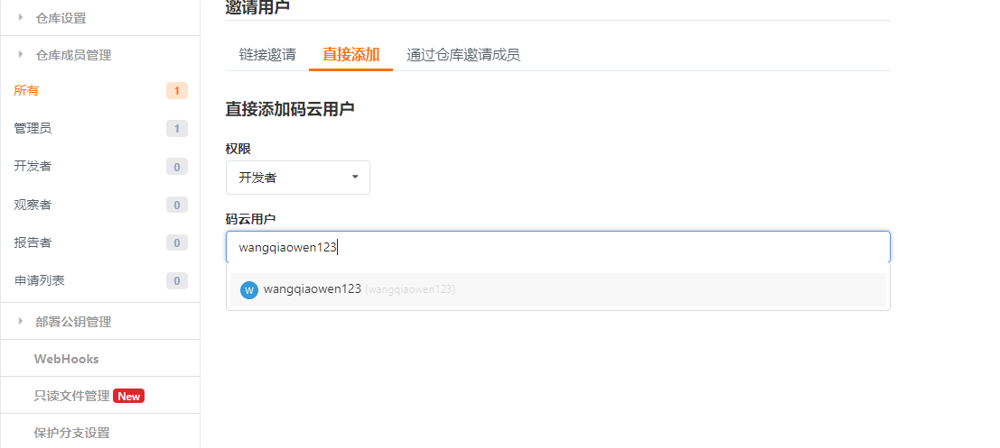


#### 注意点：

1. gitee角色(master分支受保护的情况下)
   1. 所有者：仓库拥有者
   2. 管理员：权限说明：管理员拥有仓库的全部权限，不包括删除仓库和清空仓库等
      1. 有合并master分支的权限
   3. 开发者：能push到自己的分支，不能合并到master
   4. 观察者：只能克隆，不能推送
2. 仓库设置为开源
   1. 基本设置，是否开源，设置为公开


## 20.git协同开发-克隆项目(组员)

**1.打开码云，找到你们组的项目**
1. 不要在git项目里面克隆项目
2. 尽量用ssh方式

```bash
# 在合适目录操作  (仓库地址仅供参考)
git clone 你们组的项目地址，比如git@gitee.com:jovenwang/topline-admin-yezi.git
```

##### 2.创建任务分支

```bash
# 切换到develop分支
git checkout develop
# 例如创建文章分支   规范(feature/功能)
git checkout -b feature/articles
```

- 分支命名举例
  - `feature/articles`   文章管理
  - `feature/comments`   评论管理
  - `feature/images`   素材管理
  - `feature/fans`   粉丝管理
  - `feature/settings`  设置管理

##### 3.进行开发

- 当你开发完成一个小功能需要提交代码

```bash
# 添加到暂存
git add .
# 提交本地仓库
git commit -m '备注'
git push　推送
```

##### 4.开发完毕

- 当你确认你的任务功能开发完毕后，合并到develop分支然后推送到远程(可能需要解决冲突)

```bash
# 切换到develop分支
git checkout develop
# 合并自己的任务分支   例如（featrue/questions）文章
git merge featrue/articles
# 推送develop分支 （没有配置origin直接使用仓库地址）
git push
```

#### 注意点：

1. 分支命名：规范(feature/功能)
2. **一定要在feature分支上进行开发，不要在master,develop**
3. 试一下，组员能否push master
4. 组长说git checkout无法切到develop分支，先执行git fetch/pull
5. 组员一定克隆组长创建的项目
6. 老师 组员克隆项目后直接再develop分支上 装依赖包 然后再切换到对应分支吗？？
   1. 开发时在自己的功能分支上开发。
   2. 而且.gitignore文件表示git忽略的文件或者文件夹


## 21.黑马头条后台管理系统-运行

### 01.运行

> 仓库地址  https://gitee.com/jovenwang/topline-admin-template 

启动步骤：

1、克隆项目

```bash
git clone git@gitee.com:jovenwang/topline-admin-template.git
```

2、安装依赖

```bash
# 进入项目topline-admin-template目录
npm i
```

3、启动项目

1. 对于node.js项目，必须有package.json文件，属性scripts里面属性名都可以在当前目录下执行`npm run 属性名 `

```bash
# 进入项目topline-admin-template目录
npm run serve
```

4、测试项目

- 访问 http://localhost:8080/  点击登录，如下代表成功。


### 02.模板包含的功能


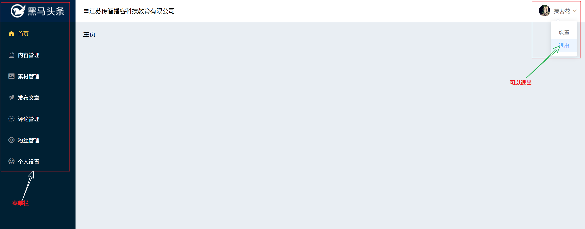


#### npm安装的问题集锦

1. 设置npm源为淘宝源

   1. 不要使用cnpm，解压npm包的方式和npm不一样，可能导致错误

   ```bash
   npm set registry https://registry.npm.taobao.org/ #作用npm装包从淘宝的服务器去下载
   ```

   2. 确认是否设置了淘宝源

      

2. 安装错误信息有"operation"或者"permission", 操作权限不足

   1. Mac, 命令前加 `sudo`
   2. windows 以管理员身份证执行
      1. 一般全局安装都会报错

3. 如果错误信息里面有这个".stagging"， npm缓存的问题

   1. ```bash
      npm cache clean -f
      ```

4. npm 安装路径有中文或空格的原因

   1. 在实际工作中，项目路径不有有中文或者空格

5. 网络的原因，换4G网络

6. npm包出错，可能网络原因

   1. 先把“node_modules”目录删除，重新npm install

#### 注意点

1. chrome设置默认搜索引擎

   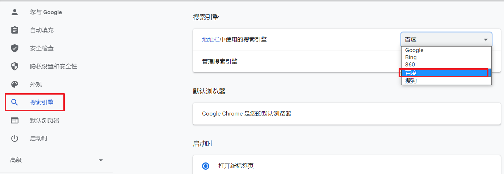

## 22.项目结构解析

**一个典型的Vue4.x脚手架生成的项目**

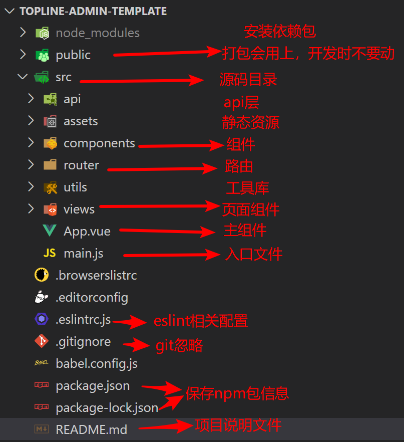


## 23.项目用到的技术栈

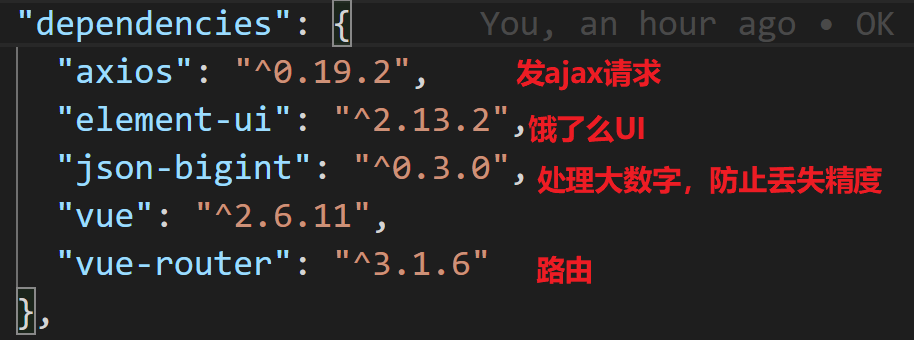


## 24.黑马头条重要文件解析

1. **main.js作为页面入口**
   1. 引入饿了么UI
   2. 引入路由表

```js
import Vue from 'vue'
import App from './App.vue'

// 引入ElementUI
import ElementUI from 'element-ui'
// 引入样式
import 'element-ui/lib/theme-chalk/index.css'

// 脚手架工具自动创建的路由配置文件
// 由于目录下有一个名为index.js 则可以简写：省略index.js
//     完整： import XXX from './router/index.js'
//     简写： import XXX from './router'
import router from './router'

// 以Vue插件的格式来引入elementUI
Vue.use(ElementUI);

Vue.config.productionTip = false;

new Vue({
  router,
  render:h => h(App)
}).$mount('#app')

```


2. **router/index.js**

   1. 配置路由
   2. 前置路由如果进入主页没有登录跳转登录

   ```js
   // 设置路由
   // 这个文件是由脚手架工具自动生成的
   
   // 功能：设置路由。决定哪个地址显示哪个组件
   import { getUser } from '../utils/storage'
   import Vue from 'vue'
   import VueRouter from 'vue-router'
   
   // 把组件的引入改成函数的写法
   // 以下异步引入路由，打开页面时才加载对应的组件，保证了首屏打开速度
   const Login = () => import('../views/login/index.vue')
   
   const Home = () => import('../views/home/index.vue')
   
   const Layout = () => import('../views/layout/index.vue')
   const NotFound = () => import('../views/page404/index.vue')
   Vue.use(VueRouter)
   
   // 配置路由
   const routes = [
     { path: '/login', component: Login },
     // 主页
     // 嵌套路由
     {
       path: '/',
       component: Layout,
       children: [
         // Home嵌套在主页里面
         { path: '', component: Home }
       ]
     },
     // 无法匹配路由会显示404页面
     { path: '*', component: NotFound }
   ]
   
   const router = new VueRouter({
     routes
   })
   
   // 前置路由
   // 所有的路由页面中跳转，都会先进入到这个函数中来。
   // to: 要跳入的路由信息。你要去哪里
   // from: 要跳出的路由信息。你从哪里来
   // next: 放行方法
   //   - next() : 正确跳转。允许进入到 to 路由
   //   - next(路由地址) : 不允许去to，而转去指定的路由地址
   router.beforeEach((to, from, next) => {
     // 如果想进入主页，就检查是否登录，没有的话跳转登录
     if (to.path != '/login') {
       // 检查是否有登陆信息：看localStorage中是否有保存信息
       const userInfo = getUser()
       if (userInfo && userInfo.token) {
         // 有就放行，
         next()
       } else {
         console.log('路由导航守卫:你没有登陆，请回去！')
         // 没有就回去登陆
         next('/login')
       }
     } else {
       // 如果跳转登录，直接放行
       next()
     }
   })
   
   export default router
   
   ```

   

3. **utils/request.js**

   1. 设置基地址
   2. 响应数据转JSON对象
   3. 请求自动传token

   ```js
   /**
    * 基于 axios 封装 请求模块
    */
   import { getUser } from './storage.js'
   import JSONbig from 'json-bigint'
   import axios from 'axios'
   
   // 创建axios的实例
   // 可以写自己的配置项  http://www.axios-js.com/docs/#axios-create-config
   const instance = axios.create({
     // 基地址：当前项目所有的接口都是以这个地址开头的
     baseURL: 'http://ttapi.research.itcast.cn/',
   
     // `transformResponse` allows changes to the response data to be made before
     // it is passed to then/catch
     // 允许修改响应数据，也就是请求接口后端返回数据
     transformResponse: [
       function (data) {
         // data:就是本次请求获取的数据
         // 在这里可以对它进行进一步的处理 -- JSONbig
         // 尝试把JSON字符串转成对象
         try {
           // 如果没有遇到错误，就返回 JSONbig处理之后的数据
           return JSONbig.parse(data)
         } catch (err) {
           // 后端返回数据可能不是 JSON 字符串，而JSONbig.parse()只能处理JSON字符串
           // 所以，为了保证代码可以正常执行，这里引入try-catch来捕获异常
           console.log('JSONbig转换出错', err)
           return data
         }
       }
     ]
   })
   
   // 请求拦截器
   // 所有请求发出去之前会执行的函数，都会处理的逻辑。
   instance.interceptors.request.use(
     function (config) {
       const userInfo = getUser()
       // 在请求发出去之前做一些事
       // 本次请求采用的配置
       // 每个请求headers传递token
       if (userInfo && userInfo.token) {
         // 在这里给请求加上header，设置token
         config.headers.Authorization = `Bearer ${userInfo.token}`
       }
       return config
     },
     function (error) {
       //  对请求错误做些什么
       return Promise.reject(error)
     }
   )
   
   // 默认导出
   export default instance
   
   ```


## 25.项目待完成的需求

也就是每个组需要开发的功能

| 序号 | 模块     | 子模块   | 描述                                                         | 完成 |
| ---- | -------- | -------- | ------------------------------------------------------------ | ---- |
| 1    | 登录功能 |          | 用户名+验证码完成登录                                        | √    |
| 2    | 退出登录 |          | 点击用户头像，下拉菜单选择退出，退出系统                     | √    |
| 3    | 发布文章 |          | 标题+内容+封面+频道，发布或者存入草稿。其中封面图片可选择上传或者从素材库中选择 |      |
| 4    | 内容列表 |          | 分页展示文章列表                                             |      |
| 5    |          | 修改文章 | 修改文章                                                     |      |
| 6    |          | 删除文章 | 删除文章                                                     |      |
| 7    | 评论列表 |          | 分页展示评论列表，字段为标题+评论状态+总评论数。另外可关闭评论 |      |
| 8    | 素材管理 |          | 分页展示全部素材或者收藏素材列表，可删除或者收藏素材         |      |
| 9    |          | 上传素材 | 上传图片                                                     |      |
| 11   | 账户信息 |          | 可修改用户信息，用户名、个性签名、邮箱和头像                 |      |
| 12   | 粉丝管理 | 粉丝列表 | 展示所有粉丝的列表                                           |      |
|      |          | 粉丝画像 | 根据粉丝年龄段展示柱状图                                     |      |
| %%%  | %%%%%    | %%%%%    |                                                              | %%%  |

> 首页不用

## 26.项目接口文档

参考项目资料目录 `team_combat\项目资料\接口文档.md`

更建议参考上线上接口

查看network的技巧

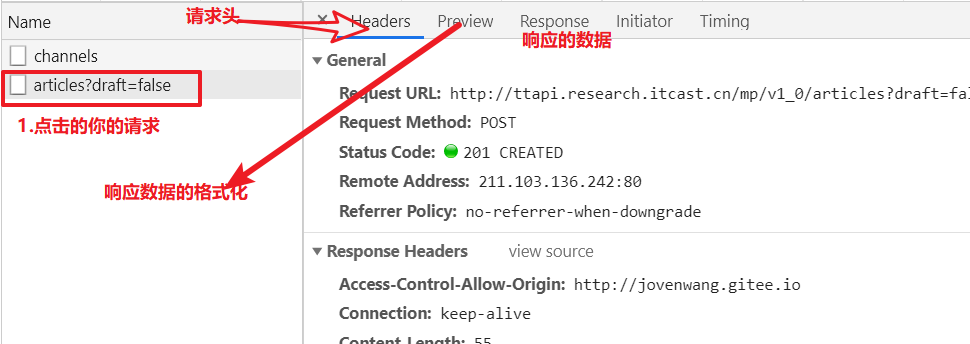


**请求重点看以下4个地方**

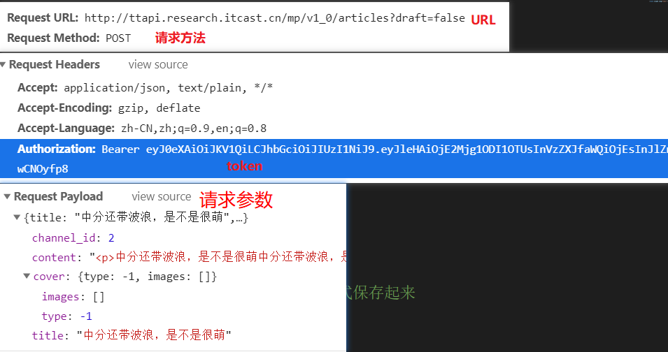

> 如果有线上接口的话，尽量参考线上的

#### 注意点：

1. 老师，两个人写一个模块的话，一般是用同个分支还是用两个分支到时候合并呢呀
   1. 先各自新建一个分支，然后再建一个共享分支
   2. 分支是就是指针，或者是说引用。


## 27.Eslint自动格式化

1. 概念：eslint检验js或者.vue文件的代码

2. 作用：

   1. 团队规范代码格式
   2. 有些公司会在git提交前强制eslint检测

3. 以下的报错就是典型的eslint错误

   

4. 如何保证统一格式呢？

   1. 安装vscode Prettier-standard插件

      1. 插件是按照js标准规范来格式化代码

      


## git冲突的解决

为什么会有git冲突？

1. git push或者git merge如果远端和本地有同文件的改动时，基本上都会冲突


模拟如何解决冲突

1. 在gitee webIDE里面，改动readme.md文件，并提交

2. 本地也改动readme.md文件，并提交。

3. 当执行git push时，报错

   

4. 执行git pull

   1. 解决冲突：需要沟通，解决完冲突后，代码里不应该包括"===="或者"<<<<"
      1. 使用本地
      2. 使用远端
      3. 两都都要

   

5. 强烈建议借助vscode来解决冲突

   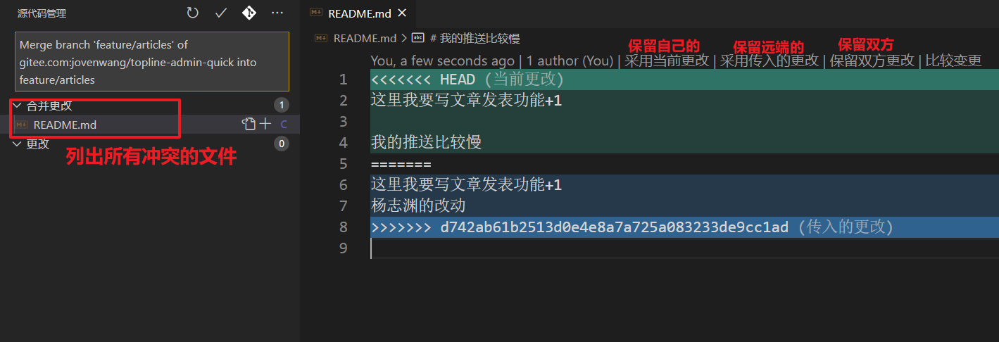

6. **解决完冲突，其实是本地改动，需要git add ., git commit, git push**

#### 注意点:

1. vscode git插件

   


## 27.禅道项目设置为私有

1. 进入 http://129.211.82.55/zentao/project-all-all.html 

2. 选择你的项目

   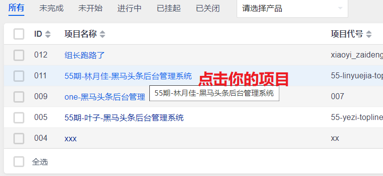

3. 编辑项目

   

4. 设置为私有

   


## 28.总结

1. 禅道使用
   1. 组长创建项目,设置团队成员并创建任务
   2. 组员, 开始任务,每天汇报进度
2. git协作
   1. 组长拉取topline-admin-template, 推送到远端
      1. 添加组员为仓库成员的开发者
      2. 新建develop分支
   2. 组员克隆项目和开发项目
      1. 尽量用ssh协议
      2. 基于develop分支创建开发分支,'feature/articles'
         1. **在你的开发分支上进行开发**
3. 项目
   1. topline-admin
4. git冲突的解决


## 29.黑马头条各组项目地址：

1. 潘树涵 https://gitee.com/PanShuHan99/topline-admin-DarkHorse
2. 江昌华 https://gitee.com/jiangchanghua/topline-admin-jch
3. 钟加乐 https://gitee.com/lelefan/topline-admin-yezi.git 
4. 艾玲 https://gitee.com/xatongxue/topline-admin-ailing.git
5. 陈松 https://gitee.com/songgebest/topline-admin-chensong56.git  
6. 王杰 https://gitee.com/soolary/topline-admin-huluwa.git
7. 傅雪涛 https://gitee.com/fu_xuetao/topline-admin-fxt.git
8. 赖海涛 https://gitee.com/qianduan_56/topline-admin-yezi

