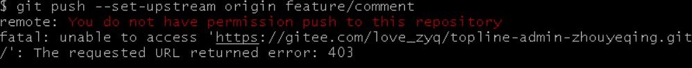
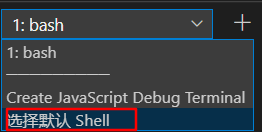
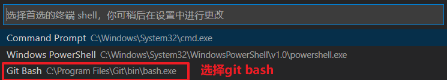
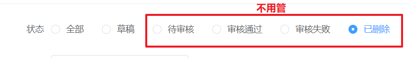
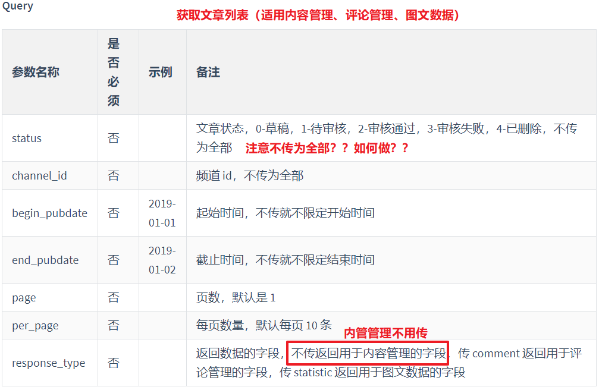
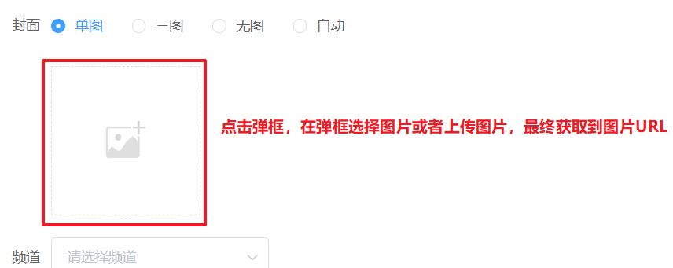

# 团队实战第2天

## 01.更新评论状态

1. put, delete ,patch和post使用上没有区别，区别在于语义化

   1. post是新增
   2. get查询
   3. delete删除
   4. put和patch都更新
      1. patch局部更新

2. 以上各种请求方法都可以url和body同时带参数 

   ```js
   async updateStatus () {
       // 发请求更新评论的状态
       const data = await request({
           // url: '/mp/v1_0/comments/status?article_id=1293180466232295424',
           url: '/mp/v1_0/comments/status',
           // `params` 是即将与请求一起发送的 URL 参数
           params:{
               // 如果数字过长，使用数字类型的话，会丢失精度(后面几位变成0)，建议直接使用字符串类型
               article_id:'1293180466232295424'
           },
           method:'PUT',
           // `data` 是作为请求主体被发送的数据
           data: {
               allow_comment: true
           }
       })
   
       console.log(data)
   }
   ```

   

## 02.如果遇到git push权限的问题

gitee被组长邀请后，点消息后，需要弹框确认

## 

## 03.vsCode选择git bash

​	在vscode可以选择命令行

1. cmd
   1. windows最原始的命令行，支持的命令少，但是和windows系统结合最深
2. powershell
   1. 微信命令行的过渡产品，可以不用考虑
3. git bash
   1. 安装git的一个附属产品，在windows这个系统里面Linux命令行


在vscode如何使用git bash

1. 下拉选择默认的shell

   

2. 选择git bash

   

3. 下次打开命令行时才生效

> git bash会显示当前项目的分支

## 04.素材图片上传

> 项目图片上传是没有问题，只不过访问有问题。可以把代码里面的图片替换掉就行

步骤：

1. 有element-ui找一个上传组件el-upload，找一个合适的例子，放到项目里面，先运行起来
2. 分析上传组件默认会以post方法把图片上传到action路径
3. 根据线上上传图片接口，修改action, 再测试时发现headers没传，body data属性是file
4. 传headers
5. name可以修改上传的文件字段名 

> 上传组件没有走axios

```js
<template>
  <el-upload
    class="avatar-uploader"
    action="http://ttapi.research.itcast.cn/mp/v1_0/user/images"
    :headers="headers"
    name="image"
    :show-file-list="false"
    :on-success="handleAvatarSuccess"
    :before-upload="beforeAvatarUpload"
  >
    
    <i v-else class="el-icon-plus avatar-uploader-icon"></i>
  </el-upload>
</template>


<script>
import { getUser } from '@/utils/storage.js'
export default {
  data () {
    console.log(`Bearer ${getUser().token}`)
    return {
      imageUrl: '',
      headers: {
        Authorization: `Bearer ${getUser().token}`
      }
    }
  },
  methods: {
    handleAvatarSuccess (res, file) {
      this.imageUrl = URL.createObjectURL(file.raw)
    },
    beforeAvatarUpload (file) {
      const isJPG = file.type === 'image/jpeg'
      const isLt2M = file.size / 1024 / 1024 < 2

      if (!isJPG) {
        this.$message.error('上传头像图片只能是 JPG 格式!')
      }
      if (!isLt2M) {
        this.$message.error('上传头像图片大小不能超过 2MB!')
      }
      return isJPG && isLt2M
    }
  }
}
</script>
```

## 05.其他小问题

1. axios传methods????
   1. 只能传method
2. comment id传递
   1. toString即可
   2. 前端在URL里面传参都是字符串
3. 个人设置图片上传
   1. el-upload的http-request自定义上传
4. `application/json`作为请求头，用来告诉服务端**消息主体是序列化的JSON字符串** 
   1. 如果axios不设置，接口也可以调通的话，不用传了
5. 个人设置的名称不能超过7个字符
6. 排查错误
   1. 页面->调api->request.js->axios->network header传参
   2. network response->axios->request.js->api层->data属性->界面
   3. 所以如果界面显示有问题，先看响应数据是否对，如果对的话，2的问题; 否则的话是1的问题
      1. 一般时候都是1的问题，重点看network传参
         1. url
         2. 方法
         3. header token
         4. request payLoad或者bdoy参数


## 06.上午注意点：

1. 粉丝画像数据是假的，而且是随机的

2. 内容管理注意点

   1. 内管管理查询状态不支持后面几种

      

   

   2.  查询接口
      1. response_type不用传
      2. axios如果参数值为null的话就不会传

   

3. 新建文章

   

4. dialog的属性` modal-append-to-body `

​	