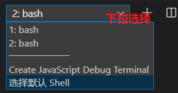
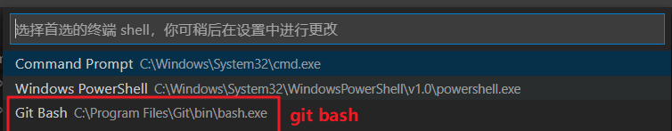
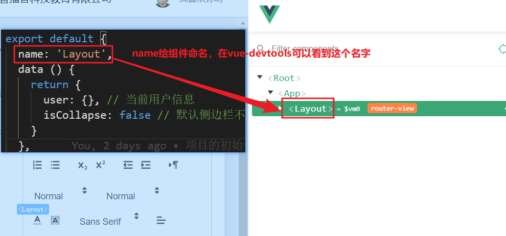

# 团队实战第2天

## 01.更新评论状态

1. put，post和delete使用没有区别，区别在于语义化
   1. put更新资源 
   2. delete删除资源
   3. post 新增资源

2. 以上几个方法都可以通过url传参

3. 具体的使用 

   ```js
   const data = await request({
       url: '/mp/v1_0/comments/status',
       method: 'PUT',
       params: {
           article_id: '1293180466232295424'
       },
       data: {
           allow_comment: false
       }
   })
   
   ```

   

## 02.如果遇到git push权限的问题

1. 使用https, 保证电脑存的用户名和密码和gitee一致。如果ssh公钥，没有这个问题
2. gitee邀请后并没有确认

## 

## 03.vsCode选择git bash

1. 命令行有好多种
   1. cmd 最基本的
   2. powershell可以不用
   3. git bash是我们装git后自带的，支持linux命令。 而且它对git很友好
      1. ls, cd ssh-key
2. 操作





注意点，第2步设置好了以后，再点+时才生效


## 04.素材图片上传

1. 对比线上接口请求，重点url,method, header token，参数
2. 查文档
3. 会以post方法发请求
4. 会走axios吗??

```js
<template>
  <el-upload
    class="avatar-uploader"
    action="http://ttapi.research.itcast.cn/mp/v1_0/user/images"
    :headers="headers"
    :show-file-list="false"
    :on-success="handleAvatarSuccess"
    :before-upload="beforeAvatarUpload"
    name="image"
  >
    
    <i v-else class="el-icon-plus avatar-uploader-icon"></i>
  </el-upload>
</template>

<script>
import { getUser } from '@/utils//storage.js'
export default {
  data () {
    return {
      imageUrl: '',
      headers: {
        Authorization: `Bearer ${getUser().token}`
      }
    }
  }
}
</script>
```


## 05.function与箭头函数

```js
export const modUserProfile = data => {
  return ajax({
    method: 'PATCH',
    url: '/mp/v1_0/user/profile',
    // data: dataObj
    data
  })
}

export const modUserProfile = function(data) {
  return ajax({
    method: 'PATCH',
    url: '/mp/v1_0/user/profile',
    // data: dataObj
    data
  })

 //以下三种function命名   
function sayHello(){

}

const sayHello = function(){

}

const sayHello = ()=>{
  
}
```


## 06.饿了么UI检验规则命名

 	2. 百度查询“饿么了 validator 命名”
     1. [传送门](https://blog.csdn.net/qq_42665866/article/details/97259223)
	3. 结论： channel和channel_id要一致

```html
<el-form-item prop="channel" label="活动区域">
    <el-select v-model="form.channel_id" placeholder="请选择活动区域">
        <el-option label="区域一" value="shanghai"></el-option>
        <el-option label="区域二" value="beijing"></el-option>
    </el-select>
</el-form-item>
```


## 07.组件的名字有啥用？




## 08.其他小问题

1. axios传methods????
2. comment id传递
   1. toString即可
3. 个人设置图片上传
   1. el-upload的http-request自定义上传
4.  `application/json`作为请求头，用来告诉服务端**消息主体是序列化的JSON字符串** 


## 09.quill-editor的自定义工具栏

1. vue脚手架里面如何使用quill-editor

   1. npm包安装

   2. 搜索时"vue quill editor"，找到github，也算是官方

      1. [传送门](https://github.com/surmon-china/vue-quill-editor)

   3. 使用

      1. 安装 “npm install vue-quill-editor --save”
      2. 页面使用

      ```vue
      <template>
        <div>
          <quill-editor :content="content" :options="editorOption" />
        </div>
      </template>
      
      <script>
      import 'quill/dist/quill.core.css'
      import 'quill/dist/quill.snow.css'
      import 'quill/dist/quill.bubble.css'
      
      import { quillEditor } from 'vue-quill-editor'
      
      export default {
        components: {
          quillEditor
        },
        data () {
          return {
            content: '<h2>I am Example</h2>',
            editorOption: {
                 modules: {
                toolbar: [
                  ['bold', 'italic', 'underline', 'strike'], // toggled buttons
                  ['blockquote', 'code-block']
                ]
              }
            }
          }
        }
      }
      </script>
      
      ```

   4. 配置工具栏

      1. 百度搜索，结合[Quill看云](https://www.kancloud.cn/liuwave/quill/1409378)

         ```js
         var toolbarOptions = [
           ['bold', 'italic', 'underline', 'strike'],        // toggled buttons
           ['blockquote', 'code-block'],
         
           [{ 'header': 1 }, { 'header': 2 }],               // custom button values
           [{ 'list': 'ordered'}, { 'list': 'bullet' }],
           [{ 'script': 'sub'}, { 'script': 'super' }],      // superscript/subscript
           [{ 'indent': '-1'}, { 'indent': '+1' }],          // outdent/indent
           [{ 'direction': 'rtl' }],                         // text direction
         
           [{ 'size': ['small', false, 'large', 'huge'] }],  // custom dropdown
           [{ 'header': [1, 2, 3, 4, 5, 6, false] }],
         
           [{ 'color': [] }, { 'background': [] }],          // dropdown with defaults from theme
           [{ 'font': [] }],
           [{ 'align': [] }],
         
           ['clean']                                         // remove formatting button
         ];
         ```

         
