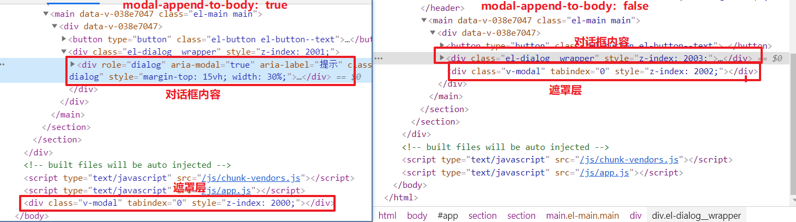
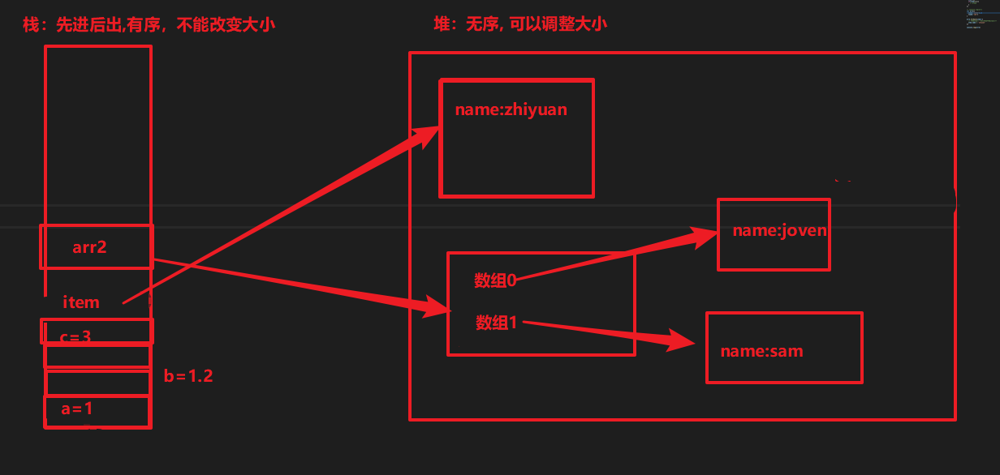
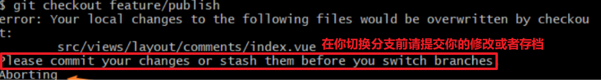
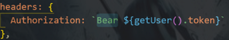
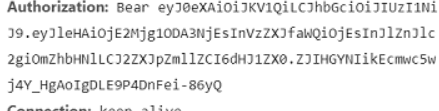
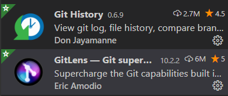
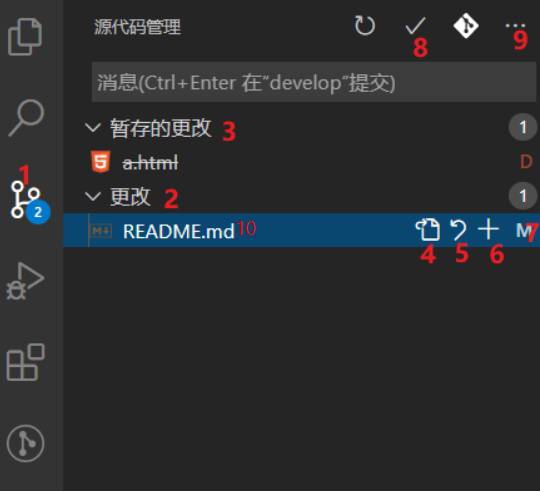
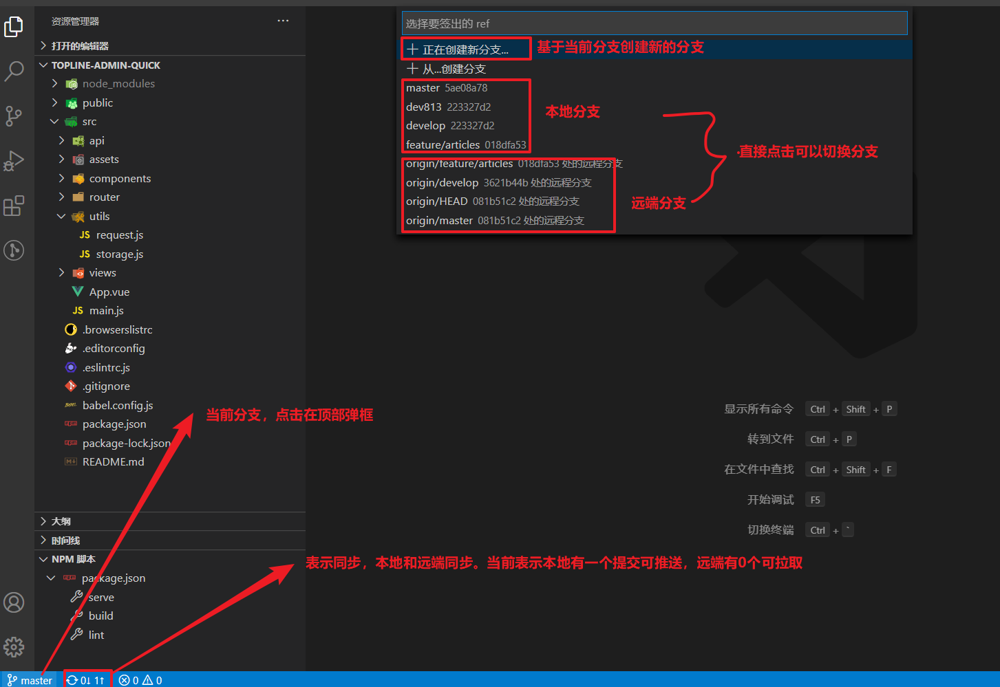
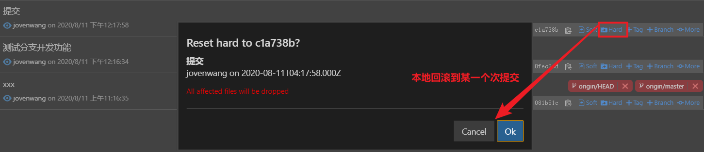

# 团队实战第3天

## 01.vue-quill-editor使用

1. 搜索`vue quill editor`找到对应的github仓库，根据说明来使用

1. 应用
   1. 装包 `npm install vue-quill-editor --save`
   2. 引入，把组件当标签使用
   3. 内容v-model="content"
2. 定制工具栏
3. 高度设置

```vue
<template>
  <div>
    <quill-editor v-model="content" :options="editorOption" />
  </div>
</template>

<script>
    <!--引入组件-->
import 'quill/dist/quill.core.css'
import 'quill/dist/quill.snow.css'
import 'quill/dist/quill.bubble.css'

import { quillEditor } from 'vue-quill-editor'

export default {
  components: {
      //注册组件
    quillEditor
  },
  data () {
    return {
      content: '<h2>I am Example</h2>',
      editorOption: {
        modules: {
          // 自定义工具栏
          toolbar: [
            ['bold', 'italic', 'underline', 'strike'], // toggled buttons
            ['blockquote', 'code-block'],

            [{ header: 1 }, { header: 2 }], // custom button values
            [{ list: 'ordered' }, { list: 'bullet' }],
            [{ script: 'sub' }, { script: 'super' }], // superscript/subscript
            [{ indent: '-1' }, { indent: '+1' }], // outdent/indent
            [{ direction: 'rtl' }], // text direction

            [{ size: ['small', false, 'large', 'huge'] }], // custom dropdown
            [{ header: [1, 2, 3, 4, 5, 6, false] }],

            [{ color: [] }, { background: [] }], // dropdown with defaults from theme
            [{ font: [] }],
            [{ align: [] }],

            ['clean']
          ]
        }
      }
    }
  }
}
</script>

<style>
/* 设置editor高度 */
.ql-editor {
  height: 400px;
}
</style>
```


## 02.function与箭头函数

```js
export const userLogin = (mobile, code) => {
  // 这个函数的返回结果是一个promise类型的数据

  // ajax是request.js中导出的axios的实例
  // 它的执行结果就是一个promise对象
  const result = ajax({
    method: 'POST',
    url: '/mp/v1_0/authorizations',
    data: {
      mobile: mobile,
      code: code
    }
  })
  return result
}

function sayHello(){
    console.log('ok')
}

const sayHello = function(){
    console.log('ok')
}

const sayHello = ()=>{
    console.log('ok')
}
```


## 03.饿了么UI检验规则命名

 Form 组件提供了表单验证的功能，只需要通过 `rules` 属性传入约定的验证规则，并将 Form-Item 的 `prop` 属性设置为需校验的字段名即可 

```html
<el-form-item prop="channel" label="活动区域">
    <el-select v-model="form.channel_id" placeholder="请选择活动区域">
        <el-option label="区域一" value="shanghai"></el-option>
        <el-option label="区域二" value="beijing"></el-option>
    </el-select>
</el-form-item>
```


## 04.个人设置图片上传

1. 使用el-upload组件，发现上传图片时post方法不能修改，只能http-request来自定义上传
2. 获取file，发送请求
3. 构造formData上传图片

```js
<template>
  <!-- action属性：自定义http-request后，action没有用，但是必填，给个空即可、
  http-request是自定义上传
   -->
  <el-upload
    class="avatar-uploader"
    action=""
    :http-request="uploadImg"
    :show-file-list="false"
    :on-success="handleAvatarSuccess"
  >
    
    <i v-else class="el-icon-plus avatar-uploader-icon"></i>
  </el-upload>
</template>

<script>
import request from '@/utils/request.js'
export default {
  data () {
    return {
      imageUrl: ''
    }
  },
  methods: {
    uploadImg (params) {
      console.log(params)
      const file = params.file
      // 构造一个formData，以multipart/form-data格式上传图片
      const formData = new FormData()
      formData.append('photo', file)
      request({
        url: 'http://ttapi.research.itcast.cn/mp/v1_0/user/photo',
        method: 'PATCH',
        data: formData
      })
    },
    handleAvatarSuccess (res, file) {
      this.imageUrl = URL.createObjectURL(file.raw)
    }
  }
}
</script>
```

参考：

> 通过FormData对象可以组装一组用 `XMLHttpRequest`发送请求的键/值对。它可以更灵活方便的发送表单数据，因为可以独立于表单使用。表单的编码类型是multipart/form-data ，则通过FormData传输的数据格式和表单通过[submit()](https://developer.mozilla.org/zh-CN/docs/Web/API/HTMLFormElement/submit) 方法传输的数据格式相同，也就是二进制文件。 

form表单与multipart/form-data的使用

```html
<form enctype="multipart/form-data" method="post" name="fileinfo" action="http://ttapi.research.itcast.cn/mp/v1_0/user/photo">
  <label>邮箱</label>
  <input type="email" autocomplete="on" autofocus name="userid" placeholder="email" required size="32" maxlength="64" /><br />
  <label>选择文件</label>
  <input type="file" name="file" required />
  <input type="submit" value="提交" />
</form>
```


## 05.dialog ` modal-append-to-body `属性



## 06.forEach的使用

1. 用来遍历
2. 不能中断，也不能修改元素本身

```js
let arr =[1,2,34,3,43,4,34,43]

// 只读不能中断遍历
arr.forEach(item=>{
  console.log(item)
  // 只读不改
  item =12
  if(item===1){
    // break
  }
})

// console.log(arr)
let arr2=[
  {name:'joven'},
  {name:'sam'}
]

arr2.forEach(item=>{
  // 改变item属性时，并没改变item本身
  item.name = 'zhiyuan'
})

console.log(arr2)
```

内存分配：




## 07.对象是无序的，如果要有序的话，声明为数组

如果前端需要一个列表，后端返回数据必须是数据不能是对象

```js
let obj = {
  c: 000,
  '1': 111,
  2: 222,
  a: 333,
  b: 444
}

console.log(obj)
// { '1': 111, '2': 222, c: 0, a: 333, b: 444 }

```


## 08.git切换分支

1. 不能在工作区和暂存区有改动时去切换分支

2. 两种方案

   1. 提交 git add ., git commit -m ''

   2. **git储藏**

      1. 保存工作的改动，类似于存档

      ```bash
      git stash -u #无论是新增还是修改文件，都存起来
      git stash pop #弹出最近一次的存档
      ```

      




## 09.定位问题：

1. 请求返回"unauthorize"

   1. 没有验证通过
   2. Bearer单词的问题
   
   




## 10.vscode与git

1. 插件

   

2. 基本功能

   1. 源码代码管理
      1. 如何打开：最左侧右键选中源代码管理
      2. 角标表示改动的文件
   2. 表示工作区改动
   3. 暂存区的改动
   4. 打开文件
   5. 撤销工作这个文件改动
   6. git add 添加到暂存区
   7. 文件的状态，M表示修改的，U表示新增的
   8. 提交了 git commit
   9. 表示更多功能
   10. 点击文件时，可以看到改动前和改动后
       1. 尽量在改动前看一下，本次提交是否有有效的

   

3. 分支

   

4. 提交历史

   1. 项目空白处，右键"git:view file HIstory"可以看到整个项目的提交历史
   2. 选中某个文件，右键"git:view file HIstory"，可以查看单个文件的提交历史
   3. 打开某个文件，鼠标focus某一行，可以看到当前这一行是哪位提交


5. 本地回滚

   

6. 远端回滚

   1. 本地回滚
   2. 强制推送到远端
      1. 考虑你有没有权限

> atom编辑器的基本上开发了vscode