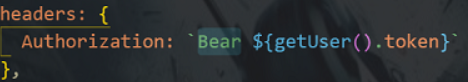

# 团队实战第3天


## 01.vue-quill-editor使用

1. 应用
2. 定制工具栏
3. 高度设置

## 02.function与箭头函数

```js
export const userLogin = (mobile, code) => {
  // 这个函数的返回结果是一个promise类型的数据

  // ajax是request.js中导出的axios的实例
  // 它的执行结果就是一个promise对象
  const result = ajax({
    method: 'POST',
    url: '/mp/v1_0/authorizations',
    data: {
      mobile: mobile,
      code: code
    }
  })
  return result
}
```


## 03.饿了么UI检验规则命名

```html
<el-form-item prop="channel" label="活动区域">
    <el-select v-model="form.channel_id" placeholder="请选择活动区域">
        <el-option label="区域一" value="shanghai"></el-option>
        <el-option label="区域二" value="beijing"></el-option>
    </el-select>
</el-form-item>
```

## 04.个人设置图片上传

1. 设置页面的图片上传问题

   1. 上传接口的方法PATCH，而饿了么UI upload组件默认是post, 查文档发现自定义上传方法，属性是"http-request"

   2. 思路上，http-request事件处理方法里面发请求“doUpload”

   3. doUpload打印参数，file对象，调接口，发现接口调用成功，但是返回的数据不对。对比发现传参是对象，并不是binaray的。

   4. 使用FormData

      ```js
       const form = new FormData()
       form.append('photo', params.file) //文件转二进制
      ```

   > 通过FormData对象可以组装一组用 `XMLHttpRequest`发送请求的键/值对。它可以更灵活方便的发送表单数据，因为可以独立于表单使用。表单的编码类型是multipart/form-data ，则通过FormData传输的数据格式和表单通过[submit()](https://developer.mozilla.org/zh-CN/docs/Web/API/HTMLFormElement/submit) 方法传输的数据格式相同，也就是二进制文件。 

```js
doUpload (params) {
    const formData = new FormData()
    formData.append('photo', params.file)

    ajax({
        url: 'http://ttapi.research.itcast.cn/mp/v1_0/user/photo',
        method: 'PATCH',
        data: formData
    })
},
```

```html
<form enctype="multipart/form-data" method="post" name="fileinfo" action="http://ttapi.research.itcast.cn/mp/v1_0/user/photo">
  <label>邮箱</label>
  <input type="email" autocomplete="on" autofocus name="userid" placeholder="email" required size="32" maxlength="64" /><br />
  <label>选择文件</label>
  <input type="file" name="file" required />
  <input type="submit" value="提交" />
</form>
```


## 05.dialog ` modal-append-to-body `属性

## 06.forEach的使用

## 07.对象是无序的，如果要有序的话，声明为数组

## 08.git切换分支


## 09.定位问题：

1. 请求返回"unauthorize"

   


## 10.vscode与git

1. 插件
2. 基本功能
3. 分支
4. 提交历史