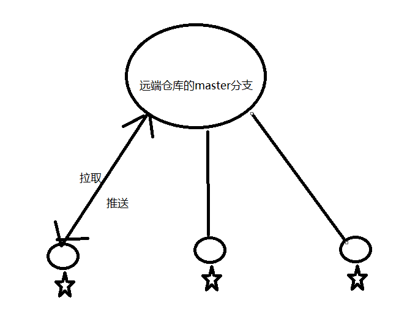
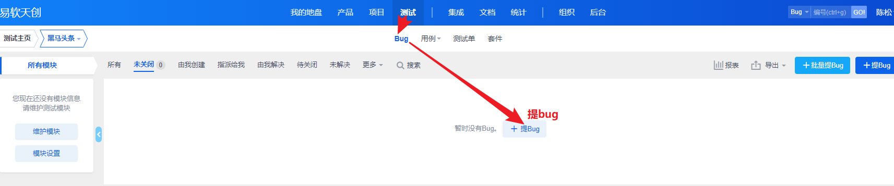
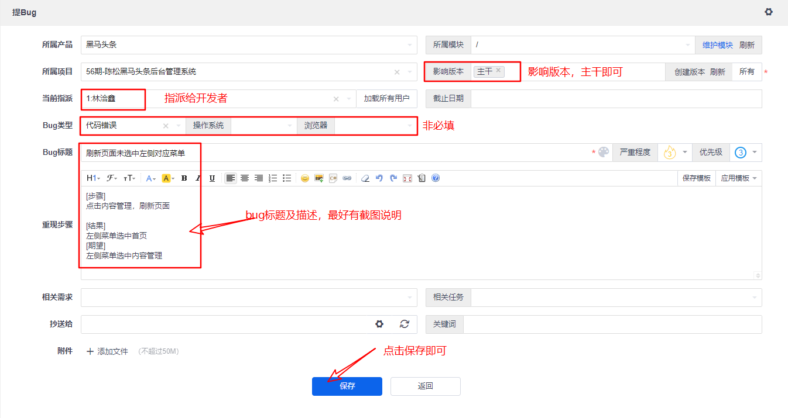
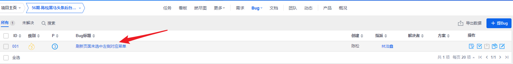
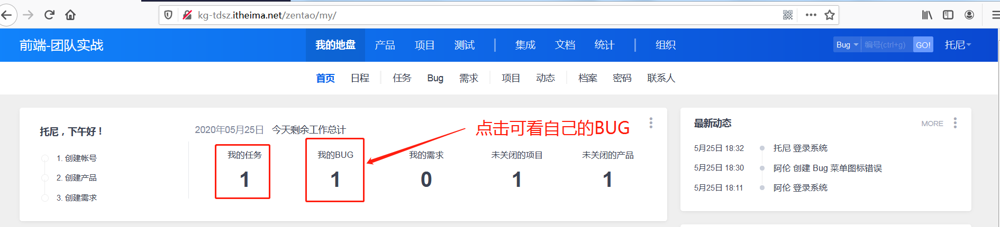
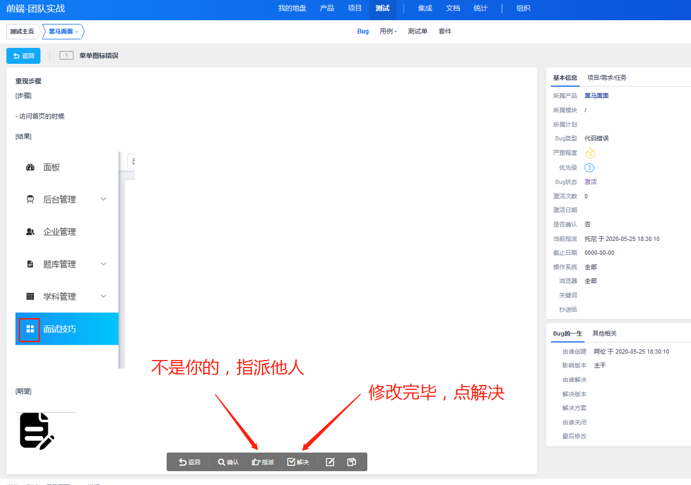

# 团队实战第4天

##  黑马头条各组项目地址：

1. 潘树涵 https://gitee.com/PanShuHan99/topline-admin-DarkHorse
2. 江昌华 https://gitee.com/jiangchanghua/topline-admin-jch
3. 钟加乐 https://gitee.com/lelefan/topline-admin-yezi.git 
4. 艾玲 https://gitee.com/xatongxue/topline-admin-ailing.git
5. 陈松 https://gitee.com/songgebest/topline-admin-chensong56.git  
6. 王杰 https://gitee.com/soolary/topline-admin-huluwa.git
7. 傅雪涛 https://gitee.com/fu_xuetao/topline-admin-fxt.git
8. 赖海涛 https://gitee.com/qianduan_56/topline-admin-yezi


## 01.json-bigint转化的id, 如何转化为字符串

1. **直接toString()即可**

2. 并不是把数组第一个元素和第二个加起来

3. BigNumber的实现相当复杂[传送门](https://www.cnblogs.com/xiangism/p/4614674.html)

   


## 02.git工作流-master分支



1. 概念: 远端仓库只有一个master分支，多个开发时候，每个人都可以推送和拉取
2. 使用：每个人都可以推送和拉取
3. 优缺点
   1. 需要不断地解决merge或者pull的冲突
   2. 如果有人推送了错误代码，影响运行的话，那其他人拉取过后，项目就无法运行
4. 应用场景
   1. 3人以下团队比较合适

## 03.git工作流-master+功能分支


1. 概念：每个功能或者需求都会新建一个功能分支，每个功能分支独立，开发完后，再合并到master分支
2. 优缺点
   1. 优点：开发还挺快
   2. 缺点：
      1. master分支会设置保护，只允许高级程序员合并和推送
         1. 团队大的话，程序员水平不一样
      2. 尽量保证master分支代码是稳定的
3. 应用场景
   1. 3~4人

## 04.git工作流-master+功能分支+develop


1. 概念：develop就是开发分支，方便功能分支开发完后合并到develop分支上，创建新分支时也要基于develop分支. 测试和修复也在develop分支
2. 优缺点
   1. 优点：比较合适大团队的，开发速度算是快
   2. 缺点：测试和修复并不是一个点，这个阶段develop分支相当于是锁定的，如果有新功能需要同时开发的话，就会阻塞
3. 应用场景
   1. 5-10人以下

## 05.git工作流-master+功能分支+develop+release


1. 概念：develop分支只创建功能分支，功能分支开发完后，合并到develop分支; 基于develop分支新建release分支用来**测试修复并发布**，release分支需要合并到develop分支和master分支 
2. 优缺点
   1. 最完整工作流
   2. 缺点：不适合小团队
3. 应用场景
   1. 10人以上的团队
4. 注意点：
   1. develop和master分支是核心分支，不能删除
   2. 功能分支和release分支是临时，用完后可以删除
   3. release一般命名"release-1.0.0"


## 06.模拟发布-拉取release分支

> 目的是让学员了解项目开发完毕后的部署过程，但是企业的部署环境肯定和此文档中不一致，所以仅供参考。

1. 组里面每一个都把自己的功能分支合并到develop分支

   ```bash
   #切换到develop分支
   git checkout develop
   #合并:把功能分支合并到develop分支
   git merge feature/articles
   #推送
   git push
   ```

2. 基于develop分支创建release分支

   ```bash
   #切换到develop分支
   git checkout develop
   #创建release-1.0.0
   git checkout -b release-1.0.0
   #推送 release-1.0.0
   git push
   ```

   

#### 注意点：

1. git merge如果没有冲突的话，就相当于是一次提交，需要推送
2. release分支上无须测试，下次发布时再测试

## 07.模拟发布-前端部署

1. gitee Pages静态页面服务

   1. 可以发布静态页面，读取一个目录，目录里面index.html文件作为主页面，对外提供一个http地址，供访问

      1. 是把某一个目录发布为服务

   2. 操作步骤

      

      

2. 项目打包，并推送代码

   1. 切换release-1.0.0分支

   2. 执行`npm run build`

   3. 不忽略dist目录

      ```js
      # 只有让git来管理这个目录，才可能把它推到远程仓库。
      #dist
      ```

   4. **删除.git文件里面hooks目录下的内容！没错，是删除！** 
   5. git  push推送

3. 在码云上部署

   

#### 注意点：

1. 一般浏览器访问的静态资源，是强缓存（服务器给你这个资源时，告诉你你不用再请求我了，因为我不会更新）
2. " https://jovenwang.gitee.io/css/app.a99fa96e.css "静态资源的路径错误

## 08.模拟发布-资源路径修改

1. 添加vue.config.js文件来修改静态资源的路径

   ```js
   module.exports ={
     // 修改index.html里面引入资源路径，从绝对路径变成相对路径
     publicPath:'./'
   }
   ```

2. 重新推送分支，并在码云pages**更新**

3. 清缓存，重新访问

   1. **打开network,勾选disable cache才生效！！**
   
   

## 09.模拟发布-release合并回develop分支和master分支

```bash
#切换到develop分支
git checkout develop
#合并release-1.0.0
git merge release-1.0.0
#可能需要解决冲突
#推送
git push

#切换到develop分支
git checkout master
#合并release-1.0.0
git merge release-1.0.0
#可能需要解决冲突
#推送
git push
```


## 10.禅道-结束任务

尽量每天下班前，填写任务


## 11.禅道-指派BUG（组长或讲师）

> 此操作由项目组长或者代课讲师操作。

1. 进入提Bug页面

2. 录入Bug信息，指派对应的成员。
3. 录入完毕后可看的bug列表



- 






### 12.禅道-查看BUG(组员)

> 所有组员均可能收到BUG，如果在公司禅道会绑定邮箱，你将会收到BUG邮件。

- 在主页可查看属于自己的任务和bug，点击我的BUG可进入列表。



- 进入BUG列表查看


- 进入明细查看




## 13.在release分支上修复bug,再次发布部署


## 14.封面选择


思路：默认图片和点击图片的弹框作为一个单独的组件，保证三个组件的状态是独立

步骤：

	1. 单图渲染一个组件，三图就渲染三个组件, 组件为cover
 	2. 组件Cover默认渲染一个默认 图片，点击图片时，弹框
      	1. 弹框确定时，获取imageUrl
           	1. 无论素材全部或者收藏，或者上传，最后都有一个图片url
      	2. 确定时，更新默认图片，同时把imageUrl传给父组件
 	3. 父组件注册事件，获取到imageUrl，设置给`images[点击封面下标的]=imageUrl`

#### 注意点：

1. 最基本的子传父

   1. 子组件$emit事件

      ```js
      this.$emit(事件名，参数)
      ```

   2. 父组件，父使用子组件所有的标签上注册事件

      ```html
       <!-- 父组件获取子组件的值 -->
      <cover @事件名="事件处理方法($event, index)" />
      ```

      ```js
      事件处理方法(参数){
          
      }
      ```

```vue
//父组件
<template>
  <el-form ref="form" :model="form" label-width="80px">
    <el-form-item label="封面">
      <el-radio-group v-model="form.coverNum">
        <el-radio :label="1">单图</el-radio>
        <el-radio :label="3">三图</el-radio>
      </el-radio-group>
    </el-form-item>

    <el-form-item class="cover-group">
      <div v-for="(item, index) in form.coverNum" :key="index">
        <!-- 父组件获取子组件的值 -->
        <cover @selectImg="hSelectImg($event, index)" />
      </div>
    </el-form-item>
  </el-form>
</template>

<script>
import Cover from './Cover'
export default {
  components: {
    Cover
  },
  data () {
    return {
      form: {
        coverNum: 1,
        cover: {
          images: []
        }
      }
    }
  },
  methods: {
    // 子传父，父事件处理方法，在这里获取子传父的值
    hSelectImg (imgUrl, index) {
      // console.log(imgUrl)
      // this.form.cover.images.push()
      // 如果我点击的第一张图片时,应该替换第一张
      this.form.cover.images[index] = imgUrl
    },
    onSubmit () {
      console.log('submit!')
    }
  }
}
</script>

<style lang="less" scoped>
.cover-group /deep/ .el-form-item__content {
  display: flex;
  > div {
    margin-right: 20px;
  }
}
</style>


//子组件
<template>
  <div>
    
    <el-dialog
      title="提示"
      :visible.sync="dialogVisible"
      width="30%"
      :before-close="handleClose"
      :modal-append-to-body="false"
    >
      <el-upload
        class="avatar-uploader"
        action="http://ttapi.research.itcast.cn/mp/v1_0/user/images"
        :headers="headers"
        name="image"
        :show-file-list="false"
        :on-success="handleAvatarSuccess"
      >
        
        <i v-else class="el-icon-plus avatar-uploader-icon"></i>
      </el-upload>
      <span slot="footer" class="dialog-footer">
        <el-button @click="dialogVisible = false">取 消</el-button>
        <el-button type="primary" @click="hConfirm">确 定</el-button>
      </span>
    </el-dialog>
  </div>
</template>

<script>
import { getUser } from '@/utils/storage.js'

const DEFAULT_IMG_URL = require('@/assets/default.png')

export default {
  data () {
    return {
      dialogVisible: false,
      imageUrl: '',
      coverImgUrl: DEFAULT_IMG_URL,
      headers: {
        Authorization: `Bearer ${getUser().token}`
      }
    }
  },
  methods: {
    hConfirm () {
      // 确定的时候，把imageUrl传给父组件
      // 在子组件里面this.$emit(事件名,参数)
      this.$emit('selectImg', this.imageUrl)
      this.coverImgUrl = this.imageUrl
      this.dialogVisible = false
    },
    handleClose (done) {
      this.$confirm('确认关闭？')
        .then(_ => {
          done()
        })
        .catch(_ => {})
    },
    handleAvatarSuccess (res, file) {
      this.imageUrl = res.data.url
    }
  }
}
</script>

<style lang="less" scoped>
.default-image {
  width: 100px;
  height: 100px;
}

.avatar-uploader .el-upload {
  border: 1px dashed #d9d9d9;
  border-radius: 6px;
  cursor: pointer;
  position: relative;
  overflow: hidden;
}
.avatar-uploader .el-upload:hover {
  border-color: #409eff;
}
.avatar-uploader-icon {
  font-size: 28px;
  color: #8c939d;
  width: 178px;
  height: 178px;
  line-height: 178px;
  text-align: center;
}
.avatar {
  width: 178px;
  height: 178px;
  display: block;
}
</style>
```

