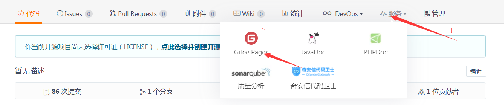

# 团队实战第4天

##  黑马头条各组项目地址：

1. 潘树涵 https://gitee.com/PanShuHan99/topline-admin-DarkHorse
2. 江昌华 https://gitee.com/jiangchanghua/topline-admin-jch
3. 钟加乐 https://gitee.com/lelefan/topline-admin-yezi.git 
4. 艾玲 https://gitee.com/xatongxue/topline-admin-ailing.git
5. 陈松 https://gitee.com/songgebest/topline-admin-chensong56.git  
6. 王杰 https://gitee.com/soolary/topline-admin-huluwa.git
7. 傅雪涛 https://gitee.com/fu_xuetao/topline-admin-fxt.git
8. 赖海涛 https://gitee.com/qianduan_56/topline-admin-yezi


## 01.json-bigint转化的id, 如何转化为字符串

1. 直接toString即可

2. 并不是把数组第一个元素和第二个加起来

3. BigNumber的实现相当复杂[传送门](https://www.cnblogs.com/xiangism/p/4614674.html)

   


## 02.git工作流-master分支

1. 所有开发者拉取和推送都在master分支上

2. 缺点：

   1. 不断解决冲突，当你git push或者git pull
   2. 如果有人推送错误代码，可能会阻止项目运行，影响其他人开发

3. 适合1-2开发

   

## 03.git工作流-master+功能分支

1. 功能分支：一般一个功能或者一个需求对应分支
   1. 并不能理解为一个页面一个分支
2. 适合3-4人开发，快速开发
3. 缺点：
   1. 如果团队比较大的话，master分支是需要保护起来，只能由高级程序员来合并或者推送


## 04.git工作流-master+功能分支+develop

1. develop用来，所有的功能分支合并到develop分支上进行测试修复发布，最后再合并到master

2. 优点：保证master分支代码不被污染

3. 一般适合5-10人开发

4. 缺点：

   1. 对于更大的团队，也不行。因为测试-修复发布上线过程中,develop是锁定的。阻止其他上merge

   


## 05.git工作流-master+功能分支+develop+release

1. release用来测试修复并发布

2. 使用：发布完后，还得合并到master分支和develop分支

3. 缺点：

   1. 工作量大呀，不适合小团队

   


## 06.模拟发布-拉取release分支

> 目的是让学员了解项目开发完毕后的部署过程，但是企业的部署环境肯定和此文档中不一致，所以仅供参考。

1. 当你确认你的任务功能开发完毕后，合并到develop分支

```bash
# 切换到develop分支
git checkout develop
# 合并自己的任务分支，可能需要解决冲突   例如（featrue/article）发布文章
git merge featrue/article
# 推送develop分支 （没有配置origin直接使用仓库地址）
git push
```

2. 基于develop分支创建release分支，进行测试

   ```bash
   #  切换到develop分支
   git checkout develop
   #基于develop分支创建release分支
   git checkout -b release-1.0.0
   #是否推送远端无所谓
   ```

## 07.模拟发布-前端部署

> 执行 `npm run build` 打包后得到，dist 文件夹。

gitee的pages服务部署

1. **修改 `.gitignore` 文件**

```diff
-/dist
+#/dist
```

2. 重新提交，提交码云

```bash
git add .
git commit -m 'dist'
git push release-1.0.0
```

3. 在码云托管dist




## 08.模拟发布-资源路径修改

1. 修改引入文件的路径，相对路径最稳

> vue.config.js 配置

```js
module.exports = {
    // 打包后index.html的依赖资源路径使用 `./` 相对路径而非使用默认的 `/`绝对路径
  publicPath: './'
}
```

2. 重新打包部署
3. 并更新

## 09.模拟发布-release合并回develop分支和master分支

```bash
#  切换到develop分支
git checkout develop
#合并release分支，可能需要解决冲突
git merge release-1.0.0
# 推送develop分支 （没有配置origin直接使用仓库地址）
git push

#  切换到master分支
git checkout master
#合并master分支，可能需要解决冲突
git merge master
# 推送develop分支 （没有配置origin直接使用仓库地址）
git push
```


## 10.禅道-结束任务

## 11.禅道-指派BUG（组长或讲师）

> 此操作由项目组长或者代课讲师操作。

1. 进入提Bug页面

2. 录入Bug信息，指派对应的成员。
3. 录入完毕后可看的bug列表


- 


### 12.禅道-查看BUG(组员)

> 所有组员均可能收到BUG，如果在公司禅道会绑定邮箱，你将会收到BUG邮件。

- 在主页可查看属于自己的任务和bug，点击我的BUG可进入列表。


- 进入BUG列表查看


- 进入明细查看


## 13.在release分支上修复bug,再次发布部署