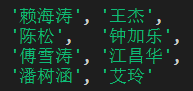

# 团队实战第5天

## 黑马头条各组项目链接：

1. 潘树涵  http://panshuhan99.gitee.io/topline-admin-darkhorse/#/ 
2. 江昌华   http://jiangchanghua.gitee.io/topline-admin-jch/#/ 
3. 钟加乐  http://lelefan.gitee.io/topline-admin-yezi/#/  
4. 艾玲  http://xatongxue.gitee.io/topline-admin-ailing 
5. 陈松  http://songgebest.gitee.io/topline-admin-chensong56/#/  
6. 王杰  http://soolary.gitee.io/topline-admin-huluwa 
7. 傅雪涛  http://fu_xuetao.gitee.io/topline-admin-fxt/#/ 
8. 赖海涛  http://qianduan_56.gitee.io/topline-admin-yezi/#/ 

## 项目答辩

顺序：

### 答辩流程

1、每一组学员推举一位答辩选手

2、答辩的内容：

- 介绍项目功能
- 介绍使用技术
- 介绍每位组员完成的功能
- 开发过程中遇到的困难是什么？你是怎么解决的？
- 演示项目

> 如果是线下：组员讲台答辩即可。

3、由代课老师评分

### 答辩评分

| 组号   | 讲师打分（80） | 学生打分（20）            | 总分 |
| ------ | -------------- | ------------------------- | ---- |
| 钟加乐 | 77             | 17+15+15+19+16=82  16.4   | 93.4 |
| 傅雪涛 | 75             | 20+15+17+15+19+14=100  20 | 95   |
| 艾玲   | 78             | 20+14+18+19+20=111  18.2  | 96.2 |
| &&&&&  | &&&&&&&        | &&&&&&&                   |      |

分数是结果，重要的是过程。