## Eslint自动格式化

1. eslint用来检测代码格式， .js和.vue

2. 作用：

   1. 团队统一代码风格
   2. 如果不统一风格，改动前和改动后，对比很夸张

3. 以下的报错就是典型的eslint错误

   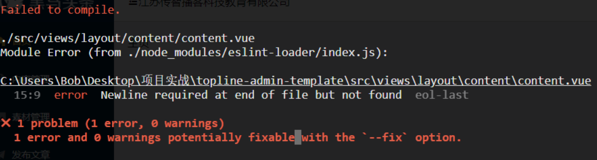

4. 如何保证统一格式呢？

   1. 在vue脚手架项目里面，eslint会按钮`.eslintrc.js`来检查你的.js和.vue文件

      1. 遵从规范 [传送门](https://github.com/standard/standard/blob/master/docs/RULES-zhcn.md)

   2. 使用vscode插件

      1.  装完后，文档格式设置方式为prettier

      

#### 注意点：

1. 尽量只格式化自己的代码
2. `/* eslint-disable */`代码以下eslint失效

## git冲突的解决

为什么会有git冲突？

1. 对于代码的改动，git无法判断哪一行是对的，就会冲突

2. 当远端文件和本地要推送文件有冲突

   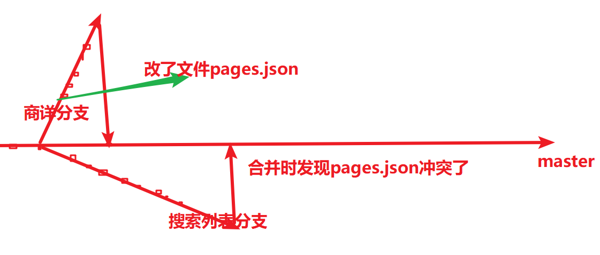

如何解决冲突

1. 提示我们使用git pull

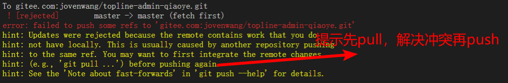

2. 执行完git pull，它会给冲突文件标记上"======="或者'<<<<<<<<<<<'

   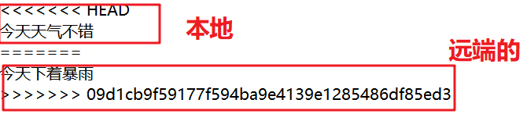

3. 和冲突代码的对方讨论一下，具体保留谁的代码，借用vscode来解决冲突

   1. 解决完冲突，不能再有"====",和">>>>>"

   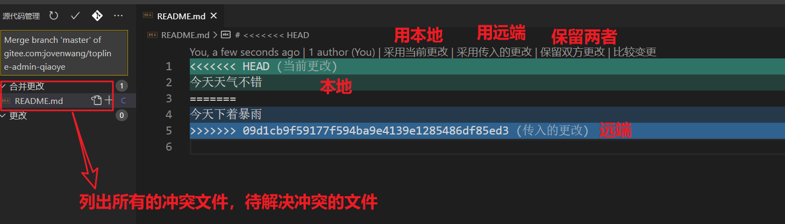

4. 解决完冲突，**正常的git add .,git commit, git push**

#### 注意点:

1. 切换分支

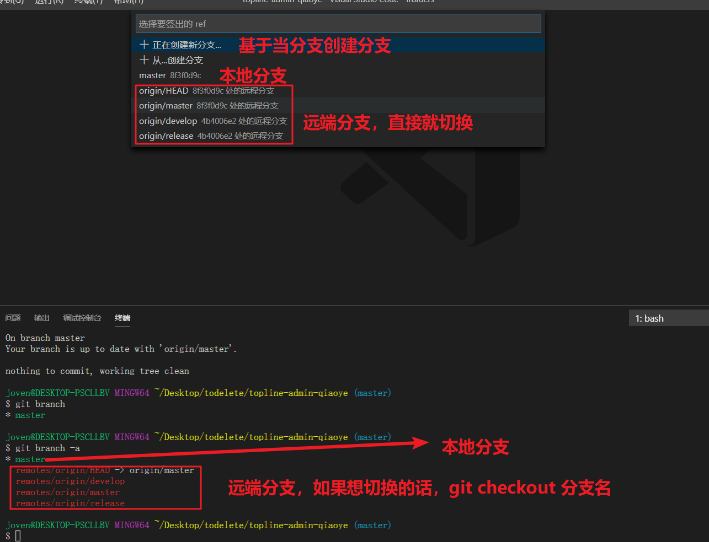


## 01.移动端适配方案flexible.js+rem

[flexible.js](https://github.com/amfe/lib-flexible)

移动端自适应：页面在不同尺寸的设备上显示良好。

#### rem是什么？

相对于html标签的font-size大小。

1. 比如html标签的字体大小是16px, 子元素如果是10rem，实际10rem相当于160px


#### flexible.js+rem自适应原理

1. 思路：只是使用rem并不能够做到自适应。如果根据不同设备尺寸给html font-size一个合适的值，那各元素就可以自适应了。
2. flexible.js正好可以根据不同设备尺寸给html font-size一个合适的值
3. 结论：**flexible.js给不同尺寸屏幕一个合适的html标签font size，然后页面各元素使用rem，就可以随屏幕尺寸自适应了。**

#### 如何使用

1. 设计稿是iphon6的2倍图，设计稿宽度750px

2. 前端写静态页面先适配iphone6

3. 方案1：根据设计稿量的大小/37.5/2就可以了

4. 方案2：结合css预处理器，声明一个@p=1/75rem，那么在less里写的话就可以把量的值直接写在代码

   1. 就相当于在h5页面可以使用"rpx"

   ```less
   // 设计稿量的大小/37.5/2 = 设计稿量的大小*@p
   @p:1/75rem;
   .rimg{
       width:232*@p;
       height: 188*@p;
   }
   //会编译成
   .rimg {
     width: 3.0933333333333337rem;
     height: 2.506666666666667rem;
   }
    
   ```

#### media query+rem和flexible.js+rem的对比

1. media query+rem是如何自适应的
   1. 比如320-375px屏幕它的html font-size是多少
2. 所以前者方案自适应并不是连续的。所以基本上选择flexible.js+rem就行

#### 近距离看flexible.js源码

html标签的字体大小设置为：屏幕宽度/10px

```js
function setRemUnit () {
    var rem = docEl.clientWidth / 10
    docEl.style.fontSize = rem + 'px'
}
```

#### 注意点：

1. 只能在uniapp和小程序写rpx


## 02.Vue原理

 当你把一个普通的 JavaScript 对象传入 Vue 实例作为 `data` 选项，Vue 将遍历此对象所有的 property，并使用 [`Object.defineProperty`](https://developer.mozilla.org/zh-CN/docs/Web/JavaScript/Reference/Global_Objects/Object/defineProperty) 把这些 property 全部转为 [getter/setter](https://developer.mozilla.org/zh-CN/docs/Web/JavaScript/Guide/Working_with_Objects#定义_getters_与_setters) 

```js
var Book = {}
var name = ''

Object.defineProperty(Book, 'name', {
    set: function (value) {
        name = value
        console.log('这本书的名字叫做：' + name)
    },
    get: function (value) {
        return '《' + name + '》'
    }
})

Book.name = 'Echo的书📖'
console.log(Book.name)
```


## 分批次请求

200个请求，每次10个请求，前一次10个请求回来后再发10个请求。

步骤：

1. 先做一次发10个请求

   1. Promise.all的使用

   ```js
   Promise.all([promise1,promise2....])
   ```

   2. 把请求封装为promise对象放进去

2. 问题：只要写axios.get的话，请求就会发出。如何10个promise放到Promise.all才开始发请求呢？？

   1. `[promise1,promise2....]`由方法返回

3. await 修饰Promise.all，多个await会相互等待，就是同步的。

4. 总结：**Promise.all就是一次发多个请求，多个await会相互等待，就是同步的**

```js
<!DOCTYPE html>
<html lang="en">
  <head>
    <meta charset="UTF-8" />
    <meta name="viewport" content="width=device-width, initial-scale=1.0" />
    <title>Document</title>
    <script src="https://cdn.bootcdn.net/ajax/libs/axios/0.20.0-0/axios.js"></script>
  </head>
  <body>
    <script>
      let url =
        'http://www.tianqiapi.com/api?version=v9&appid=23035354&appsecret=8YvlPNrz&id='

      // 如果没有函数的话，axios.get直接就发请求了
      function request10 (num) {
        let arr = []
        for (let i = 1; i < 11; i++) {
          arr.push(axios.get(url + (num*10+i)))
        }
        return arr
      }

      async function requestAll () {
        for (let i = 0; i < 20; i++) {
          // await 修饰的语句是同步，会等待的
          await Promise.all(request10(i))//promise.all里面一次发10个请求
          // await后面的语句会等待执行
          console.log('会等待请求吗')
          // await Promise.all(arr)
        }
      }

      requestAll()
    </script>
  </body>
</html>
```

#### 注意点

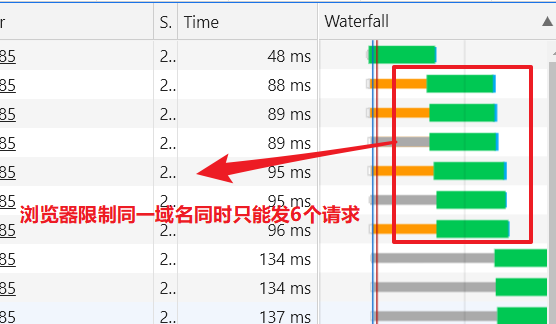

## 变量提升


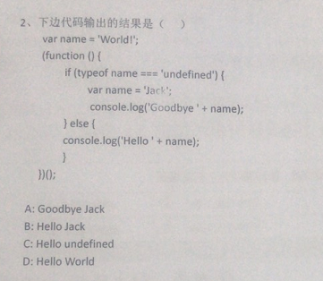

### 写一个闭包

1. 函数里面包含一个函数，一般外层函数会返回内层函数,内层函数可以访问到外层函数的变量。

2. 闭包容易内存泄露

   ```js
   // 闭包就是函数里包括函数
   function cal () {
       let num = 99
       function add () {
           num++
           console.log('我是方法add', num)
       }
       return add
   }
   
   let aa = cal()
   
   aa()
   aa()
   aa()
   aa()
   ```

   

### 什么时候会产生跨域？如何解决？

1. 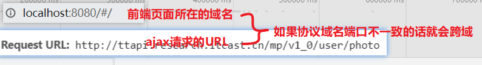

2. 同源策略：协议，域名和端口都要全部一致

3. 解决方法

   1. JSONP（不常用）

      1. [传送门](https://www.yuque.com/qiaoye-8p2ik/af829f/mf7lcg)

   2. CORS(最常见)

      ```js
      res.header('Access-Control-Allow-Origin', req.headers.origin)
      res.header('Access-Control-Allow-Methods', 'GET,PUT,POST,DELETE,OPTIONS')
      res.header('Access-Control-Allow-Headers', 'Content-Type')
      ```

   3. TODO-服务器代理（开发时用）

      1. 我访问我的服务器，服务器代替我去访问接口
      2. webpack proxy


## 02.面试题-跨域与服务器代理

1. cors补充说明：一般公司这样配置

   1. 至少本地http://localhost:8080，开发阶段，自己想办法解决跨域问题

   ```js
   'Access-Control-Allow-Origin': '一般在这里指定前端合法的url'
   ```

2. 在vue脚手架项目里面如果想修改webpack配置的话，vue.config.js

   ```js
   module.exports = {
     devServer: {
       open: true,
       proxy: {
         // 请求/api时，实际上是在请求http://localhost:3000
         '/api': {
           target: 'http://localhost:3000'
         }
       }
     }
   }
   ```

3. 原理

   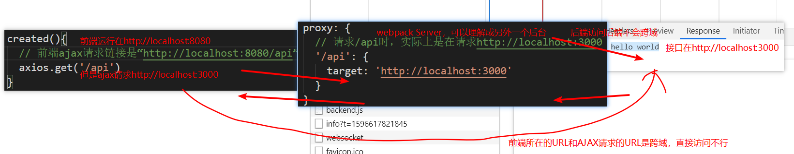

##### 注意点：

1. webpack proxy本质就是webpacke Sever代理前端去访问接口服务，利用后端访问后端不跨域的原理。
2. 这种配置只能在开发环境使用。线上还得CORS.

## 03.面试题-跨域与JSONP

1. 新建一个server，返回JSON 字符串，包括用户详细信息

   ```js
   var http = require('http')
   
   http
     .createServer(function (req, res) {
       res.end('{name:"joven",age:30}')
     })
     .listen(3000) //在电脑上启动一个服务，监听在3000端口
   console.log('服务启在：http://localhost:3000')
   
   ```

2. 前端有一个html，ajax请求http://localhost:3000, 。

3. 跨域，如何解决呢？

   1. 发现script src=http://localhost:3000，可以跨域访问接口
   2. script src的URL上传参callback
   3. 后端获取到参数`getname(响应数据)`，那么前端获取到数据时，相当于是对函数的调用
   4. 前端声明一个函数，那么函数的形参自动变成响应数据

4. 原理

   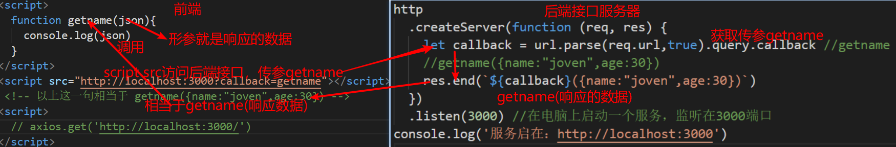

#### 注意点：

1. JSONP利用了script src访问接口不跨域的特性
2. 后端返回一个字符串，相当于是函数调用
3. `new Image().src`也可以跨域，一般用在发请求并不需要回应


### 04.请使用ES6语法编写一个arrayMerge()函数，调用时传递任意数量的数组，返回一个合并后的数组

1. 或者用...展开运算符也行

```js
function arrayMerge(){
  // 如何获取参数，参数是动态的
  // console.log(arguments)
  // arguments虽然不是数组，但是是类数组，可以遍历的
  let arr =[]
  for(let i=0;i<arguments.length;i++){
    // console.log(arguments[i])
    // concat合并数组，并返回新数组
    arr = arr.concat(arguments[i])
  }
  console.log(arr)
  return arr
}
```


1. 简历建议

   1. 技术名词不要写错了,`uni-app`, `Vue.js`或者`Vue`, `Android`, `iOS`,`iPad`
      1. `Uniapp`(x)
   2. 尽量不要在项目描述里面写太多技能点，说业务逻辑
      1. 典型商城类业务，分类->搜索->商详->加入购物车或者立即购买->购物车改变商品勾选状态和数量，下单，再完支付
      2. 登录：小程序授权登录
      3. 有支付功能
      4. 使用vuex
      5. 购物车有部分存在storage, 部分通过接口获取

2. 简历的开发框架+开发环境怎么列？

   1. 开发框架：Vue.js+axios+vue-router+vuex+element-ui+webpack (项目里面牛逼的Npm包), uni-app

   

   2. 开发环境：
      1. VsCode+ webstorm + Hbuilder+ 微信开发者工具


#### 01.跨域与CORS

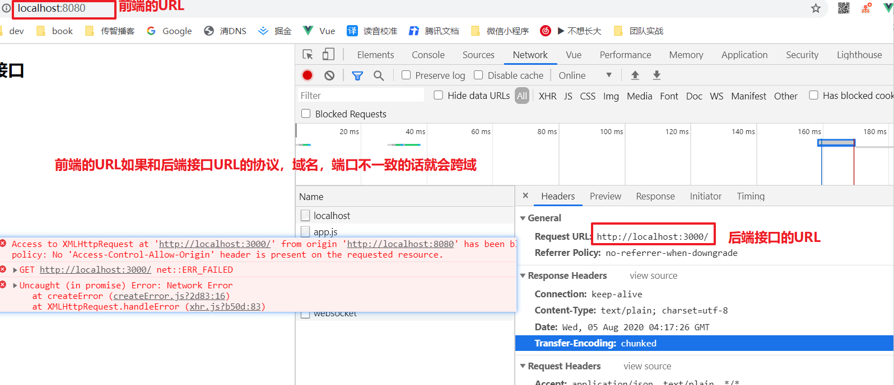

1. JSONP

2. CORS

3. 服务器

4. 模拟步骤 

   1. 本地启动一个server, 监听在3000端口

      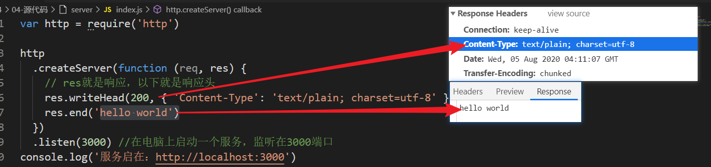

      ```js
      var http = require('http')
      
      http
        .createServer(function (req, res) {
          // res就是响应，以下就是响应头
          res.writeHead(200, { 'Content-Type': 'text/plain; charset=utf-8' })
          res.end('hello world')
        })
        .listen(3000) //在电脑上启动一个服务，监听在3000端口
      console.log('服务启在：http://localhost:3000')
      ```

      

   2. vue-cli创建一个前端项目，并且调用这个接口

      1. vue create proxy_demo
      2. npm install axios
      3. 调接口，发现跨域了。。。

   3. 如何解决？

      1. 后端配置CORS

         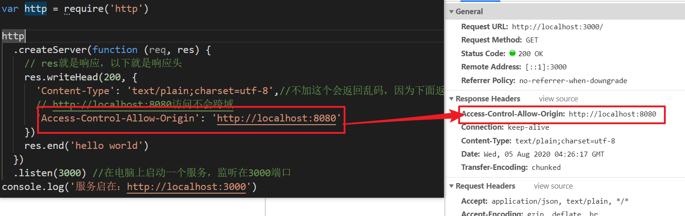


1. vsCode安装


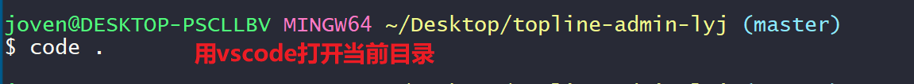


## 大公司里怎样开发和部署前端代码？

[传送门]( https://www.zhihu.com/question/20790576/answer/32602154 )

当我们在浏览器输入url并回车，到页面完全展示，其实浏览器向服务请求了很多资源，比如html,css,js,图片，ajax请求等。

	1. 这些资源中有些每次请求返回都不一样，比如删除商品的ajax请求，所以每次请求返回一个新的，合理。

   	2. 但是另外一些资源比如背景图片，可能365天都不会变，每次请求都返回，合理吗？如果浏览器把资源存着，下次直接用，是不是更好？这就是HTTP缓存。


以下场景简单描述了一下缓存的必要性：

1. 页面index.html包含a.css，无缓存
   1. 每次用户访问页面都要从服务器加载

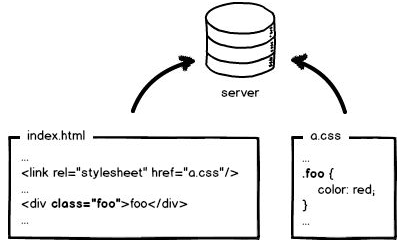


2. a.css使用缓存器缓存，协商缓存，询问服务器缓存有没有过期

   1. 还是需要请求服务器一次

   

3. 静态资源内容更新直接更新文件,从浏览器取缓存;入口文件协商缓存

   1. 静态资源强缓存，比如缓存一年
   2. 静态资源js,image,css更新直接更新文件（a_fo2bc2.css=>a_00000.css）,index.html更新引入文件的路径
   3. 只要保证index.html是新的就可以了

   


## HTTP缓存

概念： 浏览器请求某资源（html,js,css,图片等）时，如果浏览器有资源副本，就可以直接从浏览器缓存中获取，不用从服务器获取。
作用：节省流量，提高用户体验


#### 强制缓存

> 服务器说：这个文件发给你存着，我一百年不会更新的。

即浏览器直接使用缓存


1. 一般设置 cache-control里面的max-age为一个长时间，单位为秒
   1. 比如说`31536000`是指365天
2. 一般静态资源都用强缓存
   1. 不包括入口html文件


#### 协商缓存

> 服务器说：这个文件发给你存着，我可能会有更新，使用前先问一下我

浏览器缓存数据和数据的标识，下一次请求发送缓存标识给服务器，确定缓存数据有没有改动。如果没有改动，返回304，取缓存数据; 如果有改动，服务器发送请求的数据和新的标识。

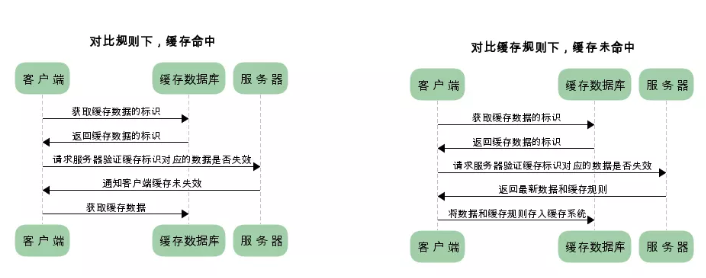


#### 总结

1. 入口文件设置协商缓存
2. 静态资源设置强缓存，cache-control里面的max-age设置时间长一些。
3. 一般对HTTP缓存的设置是由运维或者后端来设置的，但是前端需要了解这些边界问题


## HTTP缓存举例说明

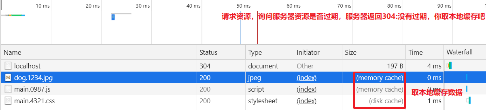


协商缓存：

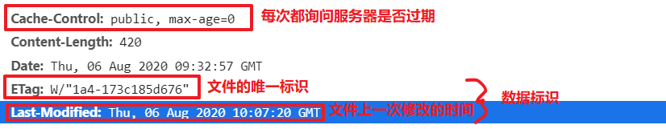

强缓存

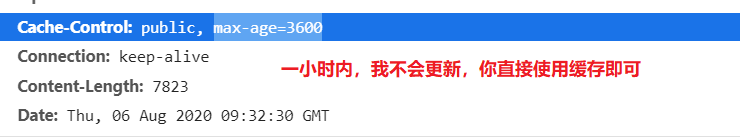


面试回答：

1. HTTP缓存分两种，强缓存和协商缓存。强缓存的意思：浏览器访问服务器资源时，服务器返回资源并告诉浏览器，XX时间内不用询问我，直接使用缓存吧。字段是cache-control: max-age: 3600。协商缓存：浏览器访问服务器资源时，服务器返回资源本身，还有资源标识，下一次需要资源时，浏览器带上资源标识去询问服务器，资源是否是最新。如果是，服务器返回304，浏览器取本地资源; 如果不是，服务器返回资源本身和资源新的标识。

#### 注意点：

1. 


## Vue异步更新队列

[传送门](https://cn.vuejs.org/v2/guide/reactivity.html#%E5%BC%82%E6%AD%A5%E6%9B%B4%E6%96%B0%E9%98%9F%E5%88%97)

> Vue 在更新 DOM 时是**异步**执行的。只要侦听到数据变化，Vue 将开启一个队列，并缓冲在同一事件循环中发生的所有数据变更 

1. vue在更新DOM时是异步的

   1. 批量处理数据的变更到DOM更新

2. 内部实现尝试用`Promise.then`, 如果没有用 `setTimeout(fn,0)`

3. Promise是微任务，setTimeout是宏任务

4. **this.$nextTick或者Vue.nextTick, 不要使用updated**

   1. 如果修改数据，希望获取到对应的dom更新的话，那么需要在Vue.nextTick里面获取
   2. this.$nextTick

   ```
   // 修改数据
   vm.msg = 'Hello'
   // DOM 还没有更新
   Vue.nextTick(function () {
     // DOM 更新了
   })
   ```

总结：修改data属性，到对应的dom更新是异步。如果想在dom更新后执行什么，this.$nextTick处理逻辑


## 事件循环(Event Loop) 


1. 所有同步任务都在主线程上执行，形成一个执行栈
2. 主线程之外，还存在一个任务队列。**只要异步操作执行完成**，就到任务队列中排队
   1. 异步任务
      1. 宏任务：事件处理方法, ajax, setTimeout(function,1000)
      2. 微任务： promise.then
   2. 只有当任务结束时，才会放到任务队列上，比如setTimeout(function,1000), 1000ms后把function放到任务列表
3. 一旦执行栈中的所有同步任务执行完毕，系统就会依次读取任务队列的异步任务，**执行所有的微任务接着执行一条宏任务**，于是被读取的异步任务结束等待状态，进入执行栈，开始执行
4. 主线程不断重复上面的的第三步
5. 宏任务与微任务(了解)
   1. 优先执行完所有的微任务（promise.then）
   2. 再执行一条宏任务(setTimeout,setInterval...)

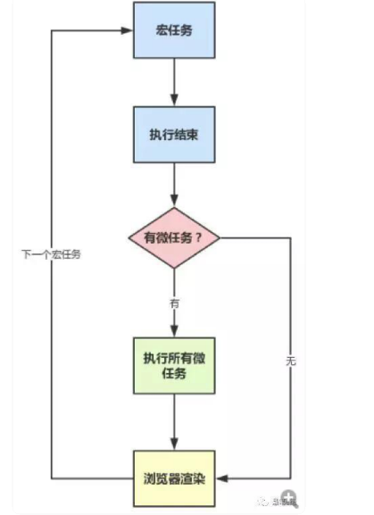


## 异步任务面试题解答

1. new Promise(fn)中的fn是同步执行；

```js
console.log('a')

setTimeout(() => {
  console.log('2');
  setTimeout(() => {
    console.log('100');
  });
}, 0);

var promise = new Promise(resolve => {
  setTimeout(() => {
    console.log('3');
  }, 0);
  console.log('4');
  resolve()
})

promise.then(() => {
  console.log('5');
  setTimeout(() => {
    console.log('6');
    setTimeout(() => {
      console.log('200');
    }, 0);
  }, 0);
})

setTimeout(() => {
  console.log('7');
}, 0);

console.log('8');
```

##### 思路:

1. 执行同步代码，打印a, 添加一个S2,打印4，添加S3, 添加微任务p5, 添加宏任务S7，打印8。
   1. 这个异步任务队列：S2,S3,S7
2. 第一次事件循环，先执行所有的微任务，打印5并添加S6, 执行一条宏任务，打印2，添加S100
   1. 这个异步任务队列：S3,S7,S6,S100
3. 第2次事件循环, 执行一条宏任务,执行S3,打印3
4. 第3次事件循环, 执行一条宏任务,执行S7,打印7
5. 第4次事件循环, 执行一条宏任务,执行S6,打印6，并添加宏任务S200
6. ... 打印 100，200

> 最终顺序是 a,4,8,5,2,3,7,6,100,200


### 面试问到怎么兼容安卓和ios，老师可以说下大概怎么处理？

> 也有说跨浏览器

1. 自适应，flexible.js+rem适应了iphone6，其他非平板设备都自适应了

   1. 小程序用rpx
   2. 最好font-size也随设备自适应

2. 在webpack的工程里，css属性的前缀默认添加

   1. transform
   2. -webkit-transform

3. 在webpack工程里，添加babel-ployfill。比如一些低端手机不支持promise，写promise语法也会转成es5

4. 如果想使用一些新的CSS属性或者js-api的话，先去caniuse上查一下兼容性。比如flexbox在手机端兼容性不错，但是grid就比较差了。

   1. display:flex配合自适应布局非常好

5. 日期格式的解析'2019-12-16', 这种日期格式在安卓上能Data.parse，但是iOS不行。需要统一转成'2019/12/16'

6. api使用遵从规范，有一些不符合规范的api使用了，可能部分手机上可以，其他设备就不一定了。

   1. 比如小程序里面没有span标签，强行使用的话，可能不同设备解析不一样。
   2. 请求后端数据返回列表，如果是对象，是无序的。即使有些设备上有序，其他设备也无序。应该返回**数组**
   3. uniapp  ul>li改成view

7. 测试一些基本设备

   1. 安卓普通的，全面屏
   2. iOS，iphone4s,iphoneX
      1. iphonex，一般头部或者底部margin
   3. iOS系统版本，10.2，12.。。
   4. 如果需要兼容h5，那么微信浏览器

#### 经验：

1. ios10.2如果const不认识，10.2 const可以
2. 日期格式的解析'2019-12-16', 这种日期格式在安卓上能Data.parse，但是iOS不行。需要统一转成'2019/12/16'


## Vue-element-admin权限管理解析

[项目官方文档](https://panjiachen.github.io/vue-element-admin-site/zh/)

#### 项目安装

1. 安装python 2.7.x
   1. sass
2. 执行npm rebuild node-sass 重构一下
3. 以管理员身份npm install
4. 注释掉main.js 31、34行
5. 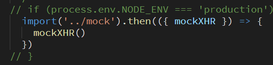
6. npm run dev

[权限管理详细说明](https://juejin.im/post/591aa14f570c35006961acac) 

1.  创建vue实例的时候将vue-router挂载，但这个时候vue-router挂载一些登录或者不用权限的公用的页面。 
    1. router/index.js中声明了无须权限路由，并初始化了路由
2.  当用户登录后，获取用role，将role和路由表每个页面的需要的权限作比较，生成最终用户可访问的路由表。 
    1. /permission.js
3.  调用router.addRoutes(store.getters.addRouters)添加用户可访问的路由。 
    1. /permission.js
4.  使用vuex管理路由表，根据vuex中可访问的路由渲染侧边栏组件。 
    1. layout/components/Sidebar/index.vue

#### 面试回答：

权限控制的主体思路，前端会有一份路由表，它表示了每一个路由可访问的权限。当用户登录之后，通过 **token** 获取用户的 **role** ，动态根据用户的 **role** 算出其对应有权限的路由，再通过`router.addRoutes`动态挂载路由。但这些控制都只是页面级的，说白了前端再怎么做权限控制都不是绝对安全的，后端的权限验证是逃不掉的。

> 项目npm install node-sass的问题，[参考传送门](https://blog.csdn.net/xdongll/article/details/75040808)


问题：

1. 老师 实际工作中 app都是用uni-app开发的是吗？ 不是

   1. 大部分时候是由安卓和iOS程序来提供原生App的壳，并提供原生接口供js调用。
      1. 前端工作量95%还是在写h5页面，5%用js调用原生
   2. 如果公司没有安卓和iOS程序员的 话，那就选择uniapp吧。

2. this.$nextTick的作用

   ```js
   //这里改变data属性
   this.msg ='这是一个下雨天'
   //这里msg改变，对应的dom还没有更新
   this.$nextTick(()=>{
       //dom更新了
   })
   ```

   