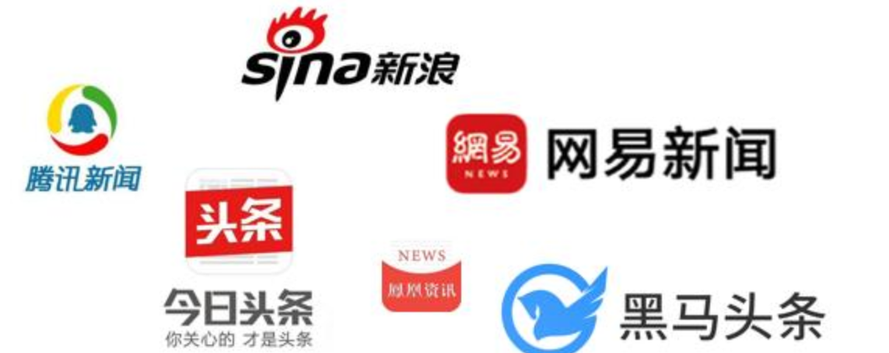
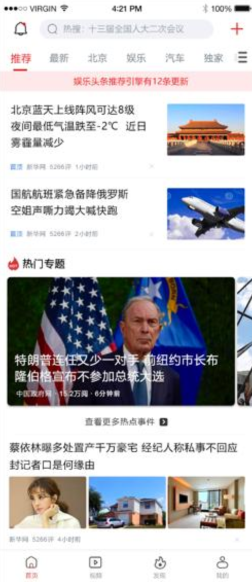
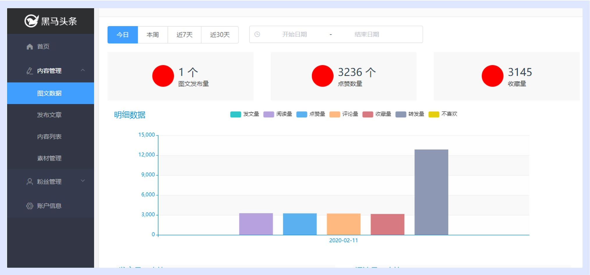

# 项目介绍

## 01.项目介绍-背景

随着智能手机的普及，人们更加习惯于通过手机来看新闻。由于生活节奏的加快，很多人只能利用碎片时间来获取信息，因此，对于移动资讯客户端的需求也越来越高。黑马头条项目正是在这样背景下开发出来。本项目主要着手于获取最新最热新闻资讯，通过大数据分析用户喜好精确推送咨询新闻。 

## 02.项目介绍-产品

产品名称：黑马头条后台管理系统

产品简介：黑马头条移动端就一个新闻资讯App, 需要发布新闻进行管理，所以需要开发一个后台管理系统。

产品目标：后台管理系统数据支撑。

## 03.项目介绍-功能

​	[参考完整项目](http://129.211.82.55:8080/#/)

| 序号 | 模块     | 子模块   | 描述                                                         | 完成 |
| ---- | -------- | -------- | ------------------------------------------------------------ | ---- |
| 1    | 登录功能 |          | 用户名+验证码完成登录                                        | √    |
| 2    | 退出登录 |          | 点击用户头像，下拉菜单选择退出，退出系统                     | √    |
| 3    | 发布文章 |          | 标题+内容+封面+频道，发布或者存入草稿。其中封面图片可选择上传或者从素材库中选择 |      |
| 4    | 内容列表 |          | 分页展示文章列表                                             |      |
| 5    |          | 修改文章 | 修改文章                                                     |      |
| 6    |          | 删除文章 | 删除文章                                                     |      |
| 7    | 评论列表 |          | 分页展示评论列表，字段为标题+评论状态+总评论数。另外可关闭评论 |      |
| 8    | 素材管理 |          | 分页展示全部素材或者收藏素材列表，可删除或者收藏素材         |      |
| 9    |          | 上传素材 | 上传图片                                                     |      |
| 11   | 账户信息 |          | 可修改用户信息，用户名、个性签名、邮箱和头像                 |      |
| 12   | 粉丝管理 | 粉丝列表 | 展示所有粉丝的列表                                           |      |
|      |          | 粉丝画像 | 根据粉丝年龄段展示柱状图                                     |      |
| %%%  | %%%%%    | %%%%%    |                                                              | %%%  |

