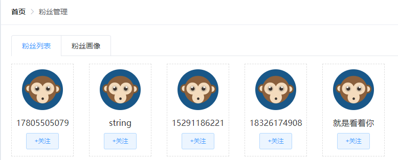

## 项目需求

**重点参考线上已经完成项目： http://129.211.82.55:8080/** 

## 01.发表文章

1. 标题和内容必填
2. 封面单选：单图，三图，无图和自动
   1. 单图展示1个上传图片位
   2. 单图展示3个上传图片位
   3. 无图和自动不展示上传图片位
3. 频道：下拉菜单，接口返回数据
4. 点击发表，发表文章
5. 点击存入草稿，存为草稿

**点击图片位弹框选择图片**

1. 素材库可选全部和收藏，均支持分页展示
   1. 选择一张图片，然后点击确定，插入图片
2. 上传图片
   1. 本地选择图片，仅支持jpg格式，点击确定插入图片

## 02.内容管理

1. 筛选区域

   1. 状态单选：全部，草稿，待审核，审核通过，审核失败，已删除
   2. 频道：下拉菜单，接口返回数据
   3. 日期选择一个时间段
   4. 点击查询按钮，根据输入或选择的筛选条件，查询第一页内容的数据且渲染列表

   

2. 列表区域

   1. 列表项：封面，标题，状态，发布时间及操作
   2. 分页功能
      1. 顶部展示总条数和当前页码
      2. 点击页码，展示对应页码的列表
   3. 点击编辑，编辑当前文章
   4. 点击删除，如果有权限，删除当前文章
      1. 只能删除草稿

   

3. 点击编辑打开新页面，展示文章内容

   1. 修改后点击保存更新

   

## 03.素材管理

1. 素材管理全部分页展示全部素材，每个素材可收藏可删除

   1. 排序是收藏图片在前面

2. 收藏展示收藏素材列表，分页

3. 点击上传图片素材，上传本地jpg图片

   

## 04.评论管理

1. 分页展示评论列表

   1. 列表项为：文章标题，总评论数，粉丝评论数，评论状态和操作

2. 点击打开评论，按钮变成关闭评论，同时评论状态变成关闭

   

## 05.粉丝管理

1. 分页展示粉丝列表
2. 展示粉丝画像

## 06.个人设置

1. 修改名称，简介邮箱以及对像，点击保存设置，右上角更新

