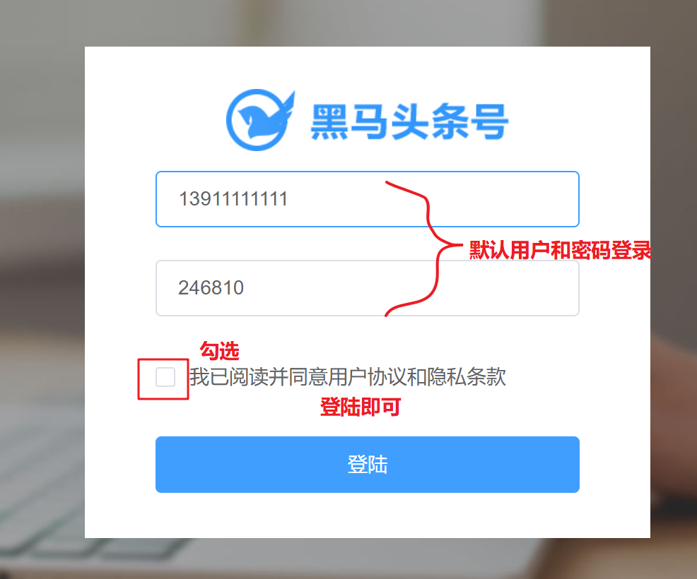

## 项目技术栈及项目结构说明

## 运行项目

> 仓库地址  https://gitee.com/jovenwang/topline-admin-template 

启动步骤：

1、克隆项目

```bash
git clone https://gitee.com/jovenwang/topline-admin-template.git
```

2、安装依赖

```bash
# 进入项目topline-admin-template目录
npm i
```

3、启动项目

```bash
# 进入项目topline-admin-template目录
npm run serve
```

4、测试项目

- 访问 http://localhost:8080/  点击登录，如下代表成功。


## 模板包含的功能




## 项目用到的技术栈


## 项目结构解析

**一个典型的Vue脚手架生成的项目**


1. main.js作为页面入口
   1. 引入饿了么UI
   2. 引入路由表

```js
import Vue from 'vue'
import App from './App.vue'

// 引入ElementUI
import ElementUI from 'element-ui'
// 引入样式
import 'element-ui/lib/theme-chalk/index.css'

// 脚手架工具自动创建的路由配置文件
// 由于目录下有一个名为index.js 则可以简写：省略index.js
//     完整： import XXX from './router/index.js'
//     简写： import XXX from './router'
import router from './router'

// 以Vue插件的格式来引入elementUI
Vue.use(ElementUI);

Vue.config.productionTip = false;

new Vue({
  router,
  render:h => h(App)
}).$mount('#app')

```


2. router/index.js

   1. 配置路由
   2. 前置路由如果进入主页没有登录跳转登录

   ```js
   // 设置路由
   // 这个文件是由脚手架工具自动生成的
   
   // 功能：设置路由。决定哪个地址显示哪个组件
   import { getUser } from '../utils/storage'
   import Vue from 'vue'
   import VueRouter from 'vue-router'
   
   // 把组件的引入改成函数的写法
   // 以下异步引入路由，打开页面时才加载对应的组件，保证了首屏打开速度
   const Login = () => import('../views/login/index.vue')
   
   const Home = () => import('../views/home/index.vue')
   
   const Layout = () => import('../views/layout/index.vue')
   const NotFound = () => import('../views/page404/index.vue')
   Vue.use(VueRouter)
   
   // 配置路由
   const routes = [
     { path: '/login', component: Login },
     // 主页
     // 嵌套路由
     {
       path: '/',
       component: Layout,
       children: [
         // Home嵌套在主页里面
         { path: '', component: Home }
       ]
     },
     // 无法匹配路由会显示404页面
     { path: '*', component: NotFound }
   ]
   
   const router = new VueRouter({
     routes
   })
   
   // 前置路由
   // 所有的路由页面中跳转，都会先进入到这个函数中来。
   // to: 要跳入的路由信息。你要去哪里
   // from: 要跳出的路由信息。你从哪里来
   // next: 放行方法
   //   - next() : 正确跳转。允许进入到 to 路由
   //   - next(路由地址) : 不允许去to，而转去指定的路由地址
   router.beforeEach((to, from, next) => {
     // 如果想进入主页，就检查是否登录，没有的话跳转登录
     if (to.path != '/login') {
       // 检查是否有登陆信息：看localStorage中是否有保存信息
       const userInfo = getUser()
       if (userInfo && userInfo.token) {
         // 有就放行，
         next()
       } else {
         console.log('路由导航守卫:你没有登陆，请回去！')
         // 没有就回去登陆
         next('/login')
       }
     } else {
       // 如果跳转登录，直接放行
       next()
     }
   })
   
   export default router
   
   ```

   

3. utils/request.js

   1. 设置基地址
   2. 响应数据转JSON对象
   3. 请求自动传token

   ```js
   /**
    * 基于 axios 封装 请求模块
    */
   import { getUser } from './storage.js'
   import JSONbig from 'json-bigint'
   import axios from 'axios'
   
   // 创建axios的实例
   // 可以写自己的配置项  http://www.axios-js.com/docs/#axios-create-config
   const instance = axios.create({
     // 基地址：当前项目所有的接口都是以这个地址开头的
     baseURL: 'http://ttapi.research.itcast.cn/',
   
     // `transformResponse` allows changes to the response data to be made before
     // it is passed to then/catch
     // 允许修改响应数据，也就是请求接口后端返回数据
     transformResponse: [
       function (data) {
         // data:就是本次请求获取的数据
         // 在这里可以对它进行进一步的处理 -- JSONbig
         // 尝试把JSON字符串转成对象
         try {
           // 如果没有遇到错误，就返回 JSONbig处理之后的数据
           return JSONbig.parse(data)
         } catch (err) {
           // 后端返回数据可能不是 JSON 字符串，而JSONbig.parse()只能处理JSON字符串
           // 所以，为了保证代码可以正常执行，这里引入try-catch来捕获异常
           console.log('JSONbig转换出错', err)
           return data
         }
       }
     ]
   })
   
   // 请求拦截器
   // 所有请求发出去之前会执行的函数，都会处理的逻辑。
   instance.interceptors.request.use(
     function (config) {
       const userInfo = getUser()
       // 在请求发出去之前做一些事
       // 本次请求采用的配置
       // 每个请求headers传递token
       if (userInfo && userInfo.token) {
         // 在这里给请求加上header，设置token
         config.headers.Authorization = `Bearer ${userInfo.token}`
       }
       return config
     },
     function (error) {
       //  对请求错误做些什么
       return Promise.reject(error)
     }
   )
   
   // 默认导出
   export default instance
   
   ```

   