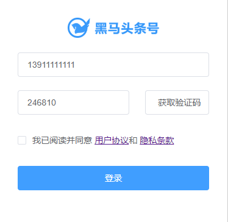
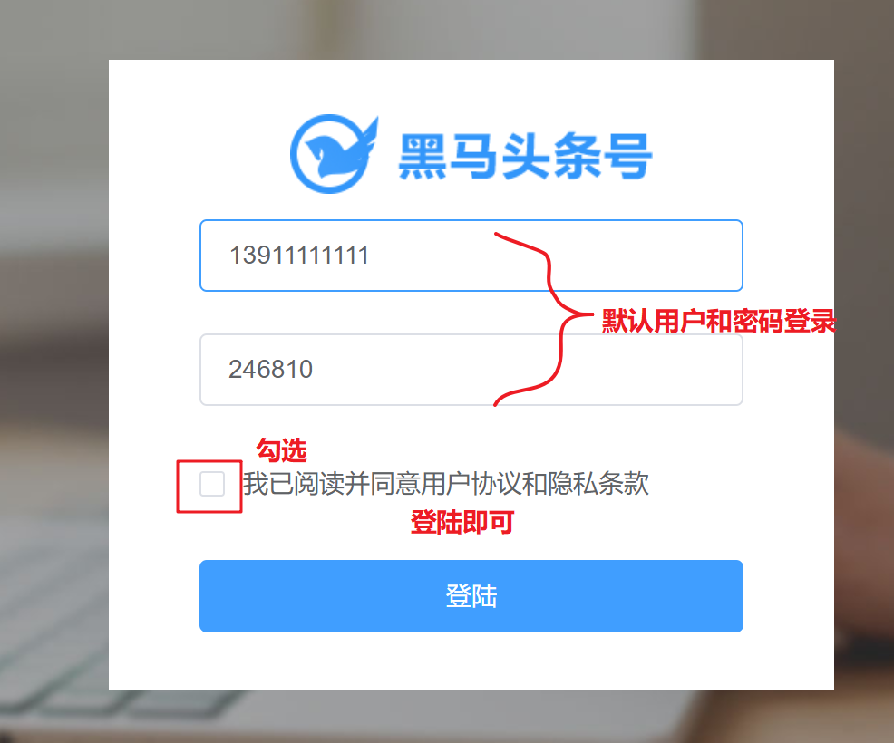
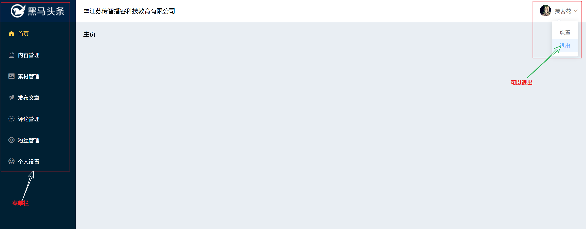

## 项目技术栈及项目结构说明

## 运行项目

> 仓库地址  https://gitee.com/jovenwang/topline-admin-template 

启动步骤：

1、克隆项目

```bash
git clone https://gitee.com/jovenwang/topline-admin-template.git
```

2、安装依赖

```bash
# 进入项目topline-admin-template目录
npm i
```

3、启动项目

```bash
# 进入项目topline-admin-template目录
npm run serve
```

4、测试项目

- 访问 http://localhost:8080/  点击登录，如下代表成功。



## 模板包含的功能







